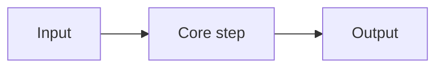

# <Human Title>

> 2-line intuition in plain words. No jargon. Say what it does + why a beginner should care.

## 1. Intuition

_For a fresher with zero background. 3–5 very short lines max. Plain words first — if you must use a technical term, explain it in 5–8 words in brackets on first use. One everyday comparison max, no storytelling. End with one tiny code/command snippet that shows the idea working._

Example shape (replace with real content):

```bash
# simplest possible demo of this idea
<command> --help
```

> You can now: <one-line win, e.g. "explain what X does in one sentence">

## 2. How it works

_5–7 bullets max, grouped under `###` mini-headings. One idea per bullet, ONE short line. Rule: snippet beats paragraph — every bullet that describes a mechanism gets a minimal runnable example right under it. No jargon dumps; define terms inline. Never repeat one concept in two bullets. Format: blank line between bullets and around snippets; each bullet = **Bold label** + one short line (never keywords alone, never a paragraph)._

- **<Plain name for step/concept>** — 1–2 plain sentences saying what it is and why it matters.

  ```bash
  <minimal command / code, 1–5 lines>
  # expected output: <1 line>
  ```

## 3. Visual



_One diagram only: flow, architecture, or user-flow. Must match the snippets above, not introduce new concepts._

## 4. Use cases

_Real jobs/tasks only — no generic rows. Each row = where a fresher meets this at work. Must include 1 edge case / common-mistake row._

| Use case | When to use (concrete example) | When NOT to / edge case |
|---|---|---|
| … | `…` + 1-line why | … + what breaks + fix `…` |

## 5. AI-era leverage

_2–3 concrete scenarios only (who + task + why this tech fits). Each with one copy-paste prompt or command. No generic "AI can help" lines._

- **<Job/task>:** … `…`
  ```text
  Ask AI: "<exact short prompt that does the task>"
  ```

## 6. Limits & tradeoffs

_3–5 bullets max. Each: plain-word limit + what breaks + what to do instead (with snippet). Point to detail, don't repeat it._

- … — breaks as: … — instead do: `…`
- Open aspects: … (in [[resources]] and [[build]])

## 7. Related

_In a track (file lives at `notes/<Slug>.md`): link the hub + `[[../context/<Track>.resources]]` + `[[../context/<Track>.build]]`, and by default NO sibling notes (hub-and-spoke keeps the graph star-shaped; add ≤4 siblings only if the reader must traverse them, and mirror them in frontmatter `related`). Single topic: link the folder-named domain hub `[[../<Domain>|Domain]]` + `[[resources]]` + `[[build]]` + ≤4 notes._

- …
