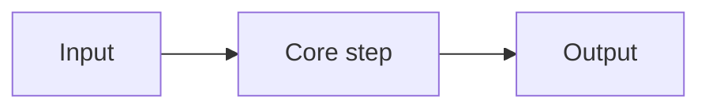

# <Human Title>

> 2-line intuition (Karpathy-style): plain words, no jargon.

## 1. Intuition

Mental model + one concrete example.

## 2. How it works

5–8 bullets max. Mechanism only. Cut trivia.

## 3. Visual

One diagram: flow, architecture, or user-flow. Graph over paragraphs.

## 4. Use cases

| Use case | When to use | When not to |
|---|---|---|
| … | … | … |

## 5. AI-era leverage

How to use this with AI on user/customer services. 2–3 concrete scenarios
(domain + who benefits + why this tech fits).

## 6. Limits & tradeoffs

- …
- Open aspects: … (points to [[resources]] and [[build]])

## 7. Related

- [[../_MOC|Domain MOC]] · [[resources]] · [[build]]
- Related notes: (≤4, must match frontmatter `related`)
