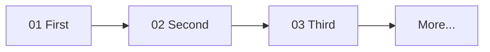

# <Track Human Title>

> 2-line promise in plain words: what this track covers end to end, and what the learner can DO after (one concrete skill, e.g. "ship X" / "debug Y").

One diagram: the learning path through every subtopic in order. Labels = subtopic plain names, no jargon.

## How to use this track

1. Start at `notes/01-...`, go in order — each note builds on the last. 15–30 min per note.
2. Each note is learn-with-snippets; `context/<Track>.resources.md` goes deeper (beyond-scope only); `context/<Track>.build.md` proves it with mini-projects.
3. After each note you can: <1 concrete thing they can now do>.

## Subtopics

| # | Note | Covers (plain words + payoff) |
|---|---|---|
| 01 | [[notes/01-Slug\|Title]] | … — you can … |
| 02 | [[notes/02-Slug\|Title]] | … — you can … |

## Related

- [[../<Domain>|Domain hub]]
