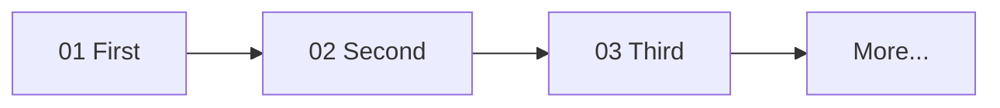

# <Track Human Title>

> 2-line promise: what this track covers end to end, and what the learner can do after.

One diagram: the learning path through every subtopic in order.

## How to use this track

1. Start at `01-...`, go in order — each row builds on the last.
2. Each subtopic is README (learn) → resources (go deeper) → build (prove it).

## Subtopics

| # | Note | Covers |
|---|---|---|
| 01 | [[01-Slug/README\|Title]] | … |
| 02 | [[02-Slug/README\|Title]] | … |

## Related

- [[../_MOC|Domain MOC]]
