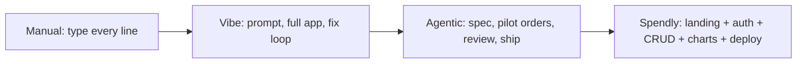

# Foundations: Vibe vs Agentic

> Claude Code is a terminal coding partner (helper that reads your whole project). Vibe coding = passenger. Agentic coding = you are the pilot, AI is the co-pilot.

## 1. Intuition

Manual coder types every line. Agentic coder gives clear orders and checks the result. A **coding agent** (AI that reads files + runs tools to do tasks) only works well when you stay in charge.

```bash
claude --help
# expected output: shows claude options (proves install works)
```

> You can now: say in one line why agentic beats vibe for real work.

## 2. How it works

### Two styles

- **Vibe coding** — plain wish in, full app out, fix-loop till it looks right; great for MVPs, fails where money is on the line.

  ```text
  Prompt: "Create a to-do list website for me"
  # expected output: full website code, then a bug-fix loop
  ```

- **Agentic coding** — you pilot with specs and reviews while AI executes; from manual coder to architect at ~10x output.

  ```text
  Vibe: passenger, AI drives blindly. Agentic: pilot + skilled co-pilot.
  ```

### The tool

- **Claude Code** — Anthropic's terminal partner: reads your whole repo, then writes, debugs, refactors, and deploys.

  ```bash
  claude
  # expected output: trust prompt + login, then chat inside project folder
  ```

- **Why it wins** — sharpest raw coding (Opus), huge context, best refactors, parallel agents, senior judgment.

  ```bash
  /model
  # expected output: pick opus-4-6 / sonnet-4-6 / haiku-4-5
  ```

- **Spendly** — the course expense tracker: landing, auth, dashboard stats, filters, full CRUD, charts.

  ```bash
  ls app.py templates/ static/ database/
  # expected output: Flask files listed (proves starter present)
  ```

> You can now: pick vibe for a prototype and agentic for production without hesitation.

## 3. Visual



Before/after art: tired solo dev at 3 monitors → smiling pilot directing 4 robots (Feature A, Refactoring, Testing, Docs, Security Scan).

## 4. Use cases

| Use case | When to use (concrete example) | When NOT to / edge case |
|---|---|---|
| Prototype weekend idea | `claude` + "Build a to-do MVP in Flask" for a demo | Production auth/payments — vague prompt hides framework, JWT-vs-session, lockout choices; fix: write spec first (see 07) |
| Join course project | Ask "What does this project do? What tech? Explain structure" | Skip overview and start coding — you edit wrong files; fix: `claude` inside folder + 3 overview questions |
| Justify Claude Code at work | Cite 10x typing saving + senior refactor + parallel agents | Team fears replacement — show horror-movie rule: fear drops once they try it hands-on |
| Edge case: vibe auth disaster | "Build me auth" silently picks framework, hash, lockout | Whole feature wrong → re-prompt loop; fix: spec lists every hidden decision upfront |

## 5. AI-era leverage

- **Manager pitch:** explain shift to product-manager role with cost line.

  ```text
  Ask AI: "Turn these 5 Claude Code advantages into a 5-line manager pitch with one 10x example."
  ```

- **Project picker:** decide vibe vs agentic for your idea.

  ```text
  Ask AI: "My idea is <one line>. Is it low-stakes prototype or high-stakes system? Recommend vibe or SDD + why in 3 bullets."
  ```

## 6. Limits & tradeoffs

- Vibe is fast to first screen, slow to correct system — breaks as hidden choices pile up — instead do: SDD spec + plan for anything with users/money.

- Claude Code needs basics — breaks as: no Python/Flask/HTML/Git means you cannot review AI output — instead do: crash-course Git first.

- Fear of replacement — breaks as: avoiding tools while peers ship 10x — instead do: one guided feature to see you move up the value chain.

- Open aspects: install in [[02-Setup-Bash-Git-Ollama|02 Setup]]; full SDD in [[07-Spec-Driven-Plan-Mode|07 SDD + Plan]]; detail sources in [[../context/Claude-Code.resources]]; proof in [[../context/Claude-Code.build]].

## 7. Related

- [[../Claude-Code|Claude Code hub]] · [[../context/Claude-Code.resources]] · [[../context/Claude-Code.build]]
