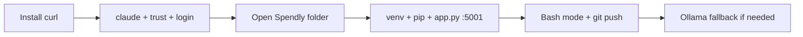

# Setup, Bash, Git, Ollama

> Install once, run inside your project folder. Terminal is home. Bash mode runs shell inside chat. Git from day one. Ollama is the free backup.

## 1. Intuition

Claude Code lives in your terminal (text screen for commands). Run it where your code lives so it can read everything. **Bash mode** (shell inside chat) means Claude sees what you ran.

```bash
curl -fsSL https://claude.ai/install.sh | bash
# expected output: Successfully installed! Version 2.1.81 at ~/.local/bin/claude
```

> You can now: install and start Claude Code in under 2 minutes.

## 2. How it works

- **What it is** — paid (~$20/mo Pro) CLI (command-line tool). Connects to Opus/Sonnet/Haiku. No GUI (picture buttons) needed.
  ```bash
  claude --help
  # expected output: flags + commands list
  ```
- **Prereqs** — Mac/Linux/Windows + terminal + claude.ai account + Pro + Node 18+ + Python 3.11+ + Git + VS Code.
  ```bash
  node -v && python3 --version && git --version
  # expected output: v18+ / 3.11+ / git version lines
  ```
- **First run** — `claude` → trust Yes → browser Authorize once, remembered after.
  ```bash
  cd ~/Desktop/spendly && claude
  # expected output: trust prompt, then login, then chat prompt
  ```
- **Starter project** — unzip → VS Code Open Folder. Has: landing working, register/login UI-only, no expenses, no DB yet.
  ```bash
  python3 -m venv venv && source venv/bin/activate
  pip install -r requirements.txt && python3 app.py
  # expected output: running at http://localhost:5001
  ```
- **Stack** — Python 3.11 + Flask (web frame) + SQLite (file DB) + Flask-SQLAlchemy (Python→DB bridge) + Jinja2 (HTML maker) + vanilla CSS + Google Fonts + pytest.
  ```bash
  cat requirements.txt
  # expected output: flask, flask-sqlalchemy, pytest lines
  ```
- **Bash mode** — Shift + `!` toggles Chat (talk) vs Bash (run). Output stays in history for follow-up questions.
  ```bash
  git status --short
  # expected output: file list Claude also sees
  ```
- **Git from start** — init → add → commit → remote → push. Needed for deploy + rollback.
  ```bash
  git init && git add . && git commit -m "initial commit"
  git remote add origin https://github.com/YOU/spendly.git
  git push origin main
  # expected output: branch main pushed to GitHub
  ```
- **Explore first** — ask What does this do? What tech? Explain structure. Saves wrong-file edits.
  ```text
  Ask Claude: "What does this project do? What tech? Explain structure."
  # expected output: summary + stack + tree with notes
  ```
- **Ollama free paths** — Cloud (free tier limits): `ollama launch claude`. Local (fully free): `ollama pull qwen2.5-coder:7b` then launch. RAM: 3B→4GB, 7B→8GB, 14B→16GB, 32B→32GB+.
  ```bash
  ollama pull qwen2.5-coder:7b
  # expected output: model downloaded, pick from list
  ```

> You can now: boot Spendly, run it, and push it to GitHub.

## 3. Visual



PDF screenshots: install success box, trust Yes prompt, Flask localhost page, Spendly landing hero.

## 4. Use cases

| Use case | When to use (concrete example) | When NOT to / edge case |
|---|---|---|
| New laptop setup | `curl ... \| bash` + `claude` + authorize once | No Node 18+ — install fails; fix: `node -v` first, install from nodejs.org |
| Start day on Spendly | `cd spendly && source venv/bin/activate && python3 app.py` | Run from wrong folder — Claude reads wrong code; fix: always `pwd` + run inside project |
| Run shell without leaving chat | Shift + `!`, run `git add .`, ask about output | Type git in chat mode — still works but messy; fix: enter Bash mode deliberately |
| Edge case: port busy / venv wrong | `python3 app.py` says address in use | Another Flask on 5001; fix: kill it or change port, re-activate venv |

## 5. AI-era leverage

- **Onboarder:** get oriented in 5 min on a new repo.
  ```text
  Ask AI: "You are inside <repo>. Tell me what it does, stack from requirements.txt/app.py, and folder tree in 10 lines."
  ```
- **Free-tier dev:** keep learning with zero budget.
  ```text
  Ask AI: "Compare Claude Pro vs Ollama cloud vs local for my 8GB laptop. Pick one and give exact pull + launch commands."
  ```

## 6. Limits & tradeoffs

- Paid wall — breaks as: no Pro = no Opus quality — instead do: Ollama cloud/local for practice, Pro for real work.
- Terminal-only power — breaks as: GUI/Desktop lack hooks/memory/subagents — instead do: use CLI for full features.
- Starter is half-built — breaks as: assuming register works — instead do: check status table (UI ready, backend missing) before demoing.
- Open aspects: sessions in [[03-Slash-Commands-Sessions|03 Slash]]; code edits in [[04-Making-Code-Changes|04 Changes]]; sources in [[../context/Claude-Code.resources]].

## 7. Related

- [[../Claude-Code|Claude Code hub]] · [[01-Foundations-Vibe-Vs-Agentic|01 Foundations]] · [[03-Slash-Commands-Sessions|03 Slash]] · [[../context/Claude-Code.resources]] · [[../context/Claude-Code.build]]
