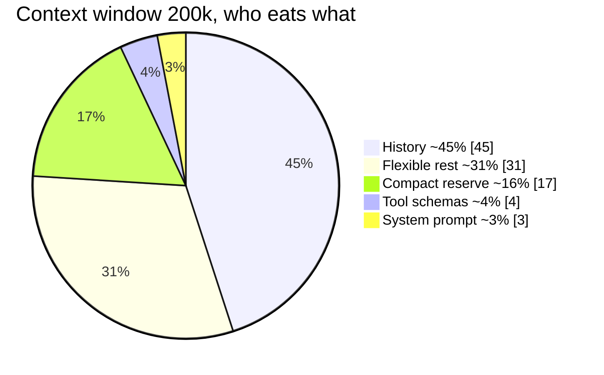
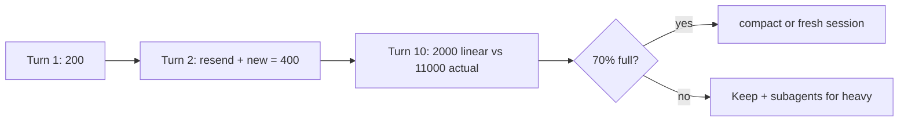

# Context Window Management

> Context window = working memory (tokens the model sees at once). Every turn resends all history, so cost grows fast (square-like). One feature = one fresh session.

## 1. Intuition

LLMs (text predictors with no memory) forget unless app resends history. Long chats = resend everything each time. **Tokens** (tiny text chunks billed) pile up.

```text
/context
# expected output: shows % used, e.g. 68% of 200k
```

> You can now: check your memory meter before quality drops.

## 2. How it works

### Costs

- **Sizes + resend math** — Sonnet ~200k, Opus 4.6 ~1M, fresh every session; each turn resends all history (10×200 tokens = 11,000, not 2,000).

  ```text
  /context -> 120k/150k usable -> quality dips
  # expected output: warning zone 120-130k
  ```

- **Replies dominate** — your orders are short, Claude's answers ~6x; sharp prompts shrink replies more than typing less.

  ```text
  Vague prompt -> 2000-token exploring answer. Sharp @ prompt -> 200-token patch.
  # expected output: 10x smaller reply for same task
  ```

### Space

- **Fixed ~23% you cannot touch** — system prompt ~6k (3%), tool schemas ~8k (4%), compact reserve ~33k (16.5%); junk like venvs never deserves the rest — verify with:

  ```bash
  cat .claudeignore
  # node_modules/ .venv/ dist/ build/ *.log .env
  # expected output: junk Claude must never read
  ```

Full numbers (usable space is really ~150k of 200k):

| Slice | Tokens | Share | Can you shrink it? |
|---|---|---|---|
| System prompt (fixed) | ~6,000 | ~3% | No — Anthropic overhead |
| Built-in tool schemas (fixed) | ~8,000 | ~4% | No — always loaded |
| Compact reserve (locked) | ~33,000 | ~16.5% | No — saved for summaries |
| Conversation history (grows) | ~90,000+ | ~45%+ | YES — fresh sessions, `/compact` |
| Tool results + MCP + skills + memory (grows) | ~rest | ~31% | YES — ignore files, few servers |

### Habits

- **Compact on your terms** — auto-compact strikes ~75–92% mid-task and corrupts; run `/compact` yourself at 70–75% between tasks.

  ```text
  /compact
  # expected output: manual summary at safe gap, Ctrl+O to review
  ```

- **Fresh sessions + CLI** — one feature per session (`/clear` wipes, subagents offload); full power needs the terminal.

  ```bash
  printf "node_modules/
.venv/
dist/
.env
" > .claudeignore
  # expected output: smaller, faster reads
  ```

> You can now: keep every session lean and cheap.

## 3. Visual



Read it: the fixed slices (system + tools + reserve ≈ 23%) are untouchable — all management happens in the growth slices (history + outputs ≈ 77%).



Read it: every turn resends all history, so cost climbs like a staircase — the only exits are compacting between tasks or starting fresh per feature.

## 4. Use cases

| Use case | When to use (concrete example) | When NOT to / edge case |
|---|---|---|
| Feature start | New session + `/rename db-setup`, pull + branch | Reuse landing session for DB — mixing + 4x cost; fix: fresh session |
| Mid-task bloat | `/context` → 72% → `/compact` between tasks | Compact mid-edit — loses active plan; fix: pause at milestone |
| Explore big repo | Delegate to subagent, keep main lean | Paste 30k codebase each turn — $1.14/8 turns; fix: 500-token plan back |
| Edge case: auto-compact mid-auth | Summary drops password rule | Auth breaks silently; fix: manual compact + review + spec on disk |

## 5. AI-era leverage

- **Token saver:** split work before overpay.

  ```text
  Ask AI: "This chat is 65% full. Summarize done vs pending in 5 lines so I can /compact safely."
  ```

- **Prompt sharpener:** cut exploring answers.

  ```text
  Ask AI: "Rewrite my vague prompt into @ files + must/must-not + 5-line scope to save tokens."
  ```

## 6. Limits & tradeoffs

- Compaction is lossy — breaks as: details vanish — instead do: specs + CLAUDE.md on disk survive; chat does not.

- `/clear` is nuclear — breaks as: needed history gone — instead do: `/export` first.

- Subagents add hops — breaks as: tiny task slower — instead do: direct for 2-line fixes.

- Open aspects: memory files in [[06-CLAUDE-md-Memory|06 Memory]]; subagent math in [[10-Subagents|10 Subagents]].

## 7. Related

- [[../Claude-Code|Claude Code hub]] · [[../context/Claude-Code.resources]] · [[../context/Claude-Code.build]]
