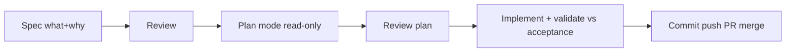

# SDD + Plan Mode

> Spec-Driven Development = write what/why before code (single truth paper). Plan Mode = read-only thinking phase (no writes, only plan). Together they kill hidden AI guesses.

## 1. Intuition

Vibe prompt "build auth" forces AI to secretly pick framework, JWT (login token) vs sessions, password rules, lockouts. One wrong pick = redo all. Spec lists every choice upfront.

```bash
ls .claude/specs/01-database-setup.md
# expected output: spec file exists before any DB code
```

> You can now: spot the hidden decisions in any vague prompt.

## 2. How it works

- **Spec 6 parts** — problem (why), functional (what), API contract (in/out), constraints (1s load, laptop screens), edges (no chats → "No history yet"), acceptance (ticked = done).
  ```markdown
  ## Acceptance: list shows, correct chat opens, new chat auto-appears
  # expected output: done is checkable, not feeling
  ```
- **Chat sidebar example** — titles from first message, click opens chat, long first msg truncated, load <1s.
  ```text
  Input: click past chat. Output: that chat in main area.
  # expected output: contract both sides agree on
  ```
- **SDD 7 steps** — spec → review → design (how doc) → review → tasks → build → validate. Reviews catch bugs before code.
  ```bash
  cat .claude/specs/01-database-setup.md
  # expected output: overview + schema + rules + acceptance
  ```
- **DB spec real** — SQLite, tables users (id, name, email unique, password_hash, created_at) + expenses (user_id→users.id, amount REAL, category, date year-month-day like 2026-05-01), funcs `get_db()` (Row + PRAGMA ON), `init_db()`, `seed_db()` no-dup, rules: raw SQL only, parameterized (safe ? marks), Werkzeug hash.
  ```python
  conn.execute("SELECT * FROM users WHERE email=?", (email,))
  # expected output: safe row, no injection
  ```
- **Plan Mode** — Shift+Tab twice or `/plan` → Plan Mode ON. Spawns readers, zero writes, saves to `.claude/plans/01-....md`. Then exit, implement with approvals.
  ```text
  Read .claude/specs/01-database-setup.md + db.py + app.py, save plan.
  # expected output: step plan file created, no code touched
  ```
- **Tuning** — Opus plan → Sonnet code. Extended thinking (scratchpad before answer) via `/config`. Effort `/effort low/medium/high/max/auto` sets reasoning tokens. Ultraplan `/ultraplan` = cloud Opus 4 + web editor for monsters.
  ```text
  /effort auto
  # expected output: Claude picks reasoning budget
  ```
- **15-step ship** — rename → pull → `checkout -b feature/x` → spec → review → plan → review → save plan → implement → validate → iterate → add/commit → push → PR merge → main pull + delete branch.
  ```bash
  git checkout -b feature/database-setup
  git push origin feature/database-setup
  # expected output: branch up, PR ready
  ```

> You can now: run spec → plan → code without losing control.

## 3. Visual



PDF tables: vibe vs SDD, hidden auth choices, API GET/POST /chats, 15 steps, Opus/Sonnet/Haiku, effort, regular vs ultraplan.

## 4. Use cases

| Use case | When to use (concrete example) | When NOT to / edge case |
|---|---|---|
| New DB layer | Spec schema + funcs + rules before Plan Mode | Code first — FK off, string SQL; fix: PRAGMA + ? marks in spec |
| Complex refactor | Ultraplan for 10-file change | Ultraplan for typo — slow + costly; fix: regular plan |
| Team handoff | Spec (PM) + design (eng) separate, stack-swappable | Mix tech in spec — FastAPI→Django rewrite; fix: keep what vs how apart |
| Edge case: spec skipped review | Missing empty-DB edge | Seed dupes; fix: enforce 2 reviews + acceptance ticks |

## 5. AI-era leverage

- **Spec writer:** turn idea into checkable doc.
  ```text
  Ask AI: "Turn <feature one-liner> into 6-part spec: problem, functionals, contract, constraints, edges, 5 acceptance boxes."
  ```
- **Plan checker:** verify before code.
  ```text
  Ask AI: "Read .claude/specs/X.md + plan. List 3 mismatches vs acceptance. Fix or stop?"
  ```

## 6. Limits & tradeoffs

- Over-spec rigid — breaks as: requirements shift mid-build — instead do: amend spec + re-plan, no silent drift.
- Needs coding skill — breaks as: non-coder cannot judge plan — instead do: learn basics first (01 prereqs).
- Plan Mode reads cost tokens — breaks as: huge repo scan — instead do: scope prompt to 3 files.
- Open aspects: auto specs via [[08-Custom-Slash-Commands-Auth|08 Commands]]; test/review gates in [[10-Subagents|10 Subagents]].

## 7. Related

- [[../Claude-Code|Claude Code hub]] · [[01-Foundations-Vibe-Vs-Agentic|01 Foundations]] · [[08-Custom-Slash-Commands-Auth|08 Commands]] · [[../context/Claude-Code.resources]] · [[../context/Claude-Code.build]]
