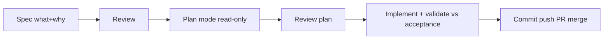

# SDD + Plan Mode

> Spec-Driven Development = write what/why before code (single truth paper). Plan Mode = read-only thinking phase (no writes, only plan). Together they kill hidden AI guesses.

## 1. Intuition

Vibe prompt "build auth" forces AI to secretly pick framework, JWT (login token) vs sessions, password rules, lockouts. One wrong pick = redo all. Spec lists every choice upfront.

```bash
ls .claude/specs/01-database-setup.md
# expected output: spec file exists before any DB code
```

> You can now: spot the hidden decisions in any vague prompt.

## 2. How it works

### Spec

- **Six checkable parts** — problem, functionals, contract, constraints, edges, acceptance boxes; done means ticked, not felt.

  ```markdown
  ## Acceptance: list shows, correct chat opens, new chat auto-appears
  # expected output: done is checkable, not feeling
  ```

- **Sidebar specimen** — titles from first message, click opens, long openers truncated, sub-second load.

  ```text
  Input: click past chat. Output: that chat in main area.
  # expected output: contract both sides agree on
  ```

### Flow

- **Seven steps, two reviews** — spec → review → design → review → tasks → build → validate; reviews catch bugs before code.

  ```bash
  cat .claude/specs/01-database-setup.md
  # expected output: overview + schema + rules + acceptance
  ```

- **DB foundation** — users + expenses tables, get/init/seed funcs; raw `?` SQL, foreign-keys ON, Werkzeug hashes.

  ```python
  conn.execute("SELECT * FROM users WHERE email=?", (email,))
  # expected output: safe row, no injection
  ```

### Plan

- **Read-only thinking** — Shift+Tab twice or `/plan`: readers scan, zero writes, plan saved for review first.

  ```text
  Read .claude/specs/01-database-setup.md + db.py + app.py, save plan.
  # expected output: step plan file created, no code touched
  ```

- **Tune + ship** — Opus plans, Sonnet builds, `/effort auto`, `/ultraplan` for monsters; 15 steps end at PR-merge.

  ```bash
  git checkout -b feature/database-setup
  git push origin feature/database-setup
  # expected output: branch up, PR ready
  ```

> You can now: run spec → plan → code without losing control.

## 3. Visual



Also tabulated: vibe vs SDD, hidden auth choices, API GET/POST /chats, 15 steps, Opus/Sonnet/Haiku, effort, regular vs ultraplan.

## 4. Use cases

| Use case | When to use (concrete example) | When NOT to / edge case |
|---|---|---|
| New DB layer | Spec schema + funcs + rules before Plan Mode | Code first — FK off, string SQL; fix: PRAGMA + ? marks in spec |
| Complex refactor | Ultraplan for 10-file change | Ultraplan for typo — slow + costly; fix: regular plan |
| Team handoff | Spec (PM) + design (eng) separate, stack-swappable | Mix tech in spec — FastAPI→Django rewrite; fix: keep what vs how apart |
| Edge case: spec skipped review | Missing empty-DB edge | Seed dupes; fix: enforce 2 reviews + acceptance ticks |

## 5. AI-era leverage

- **Spec writer:** turn idea into checkable doc.

  ```text
  Ask AI: "Turn <feature one-liner> into 6-part spec: problem, functionals, contract, constraints, edges, 5 acceptance boxes."
  ```

- **Plan checker:** verify before code.

  ```text
  Ask AI: "Read .claude/specs/X.md + plan. List 3 mismatches vs acceptance. Fix or stop?"
  ```

## 6. Limits & tradeoffs

- Over-spec rigid — breaks as: requirements shift mid-build — instead do: amend spec + re-plan, no silent drift.

- Needs coding skill — breaks as: non-coder cannot judge plan — instead do: learn basics first (01 prereqs).

- Plan Mode reads cost tokens — breaks as: huge repo scan — instead do: scope prompt to 3 files.

- Open aspects: auto specs via [[08-Custom-Slash-Commands-Auth|08 Commands]]; test/review gates in [[10-Subagents|10 Subagents]].

## 7. Related

- [[../Claude-Code|Claude Code hub]] · [[../context/Claude-Code.resources]] · [[../context/Claude-Code.build]]
