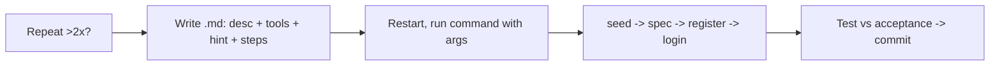

# Custom Commands & Auth

> Custom commands = saved prompts (Markdown file whose name becomes /command). Use for repeats. Demo: seed DB + auto specs + real register/login.

## 1. Intuition

Retyping "review this" daily is waste. Save once, run with `/name`. **$ARGUMENTS** (magic slot for your typed inputs) makes one file handle many values.

```bash
ls .claude/commands/seed-user.md
# expected output: file exists -> /seed-user appears after restart
```

> You can now: turn any 2x prompt into a command.

## 2. How it works

### Files

- **Filename is the command** — `seed-user.md` → `/seed-user`; restart to appear; project scope shared, user scope global.

  ```bash
  claude
  # expected output: restart picks up new /command
  ```

- **Four parts** — description, allowed-tools fence, argument hint, numbered steps; explicitness is safety.

  ```markdown
  ---
  description: Seed dummy expenses
  argument-hint: <user_id> <count> <months>
  allowed-tools: Read, Bash(python3 *)
  ---
  # expected output: shows hints while typing
  ```

### Seeds + specs

- **Seed data with $ARGUMENTS** — `/seed-user` invents unique hashed users; `/seed-expense 2 5 3` spreads INR rows, aborts on missing user.

  ```bash
  /seed-expense 2 5 3
  # expected output: 5 rows for user 2 across 3 months
  ```

- **/create-spec guards git** — reads code, writes structured spec; refuses dirty tree, pulls main, cuts `feature/<slug>`.

  ```bash
  /create-spec 03 login-and-logout
  # expected output: branch + spec file created
  ```

### Auth

- **Register then login** — POST + method/action fix, `?` queries, hashed passwords, 6/6 tests; session login/logout plus redirect guards for the spec hole.

  ```python
  session['user_id'] = user['id']
  # expected output: stays logged across pages
  ```

> You can now: seed, spec, and ship auth without retyping.

## 3. Visual



Also tabulated: 4 repeat candidates, project vs user, 4-part anatomy, seed args, guards, login diff.

## 4. Use cases

| Use case | When to use (concrete example) | When NOT to / edge case |
|---|---|---|
| Seed demo data | `/seed-expense 2 5 3` before UI demo | Seed prod DB — junk users; fix: restrict allowed-tools + local only |
| Start feature | `/create-spec 04 x` gives branch + spec | Dirty tree — mixes features; fix: guard refuses, commit first |
| Auth bug | Feed "logged-in sees /login" back, add guards | Trust spec blindly — miss item 6; fix: manual acceptance run |
| Edge case: bad args | `/seed-expense 2` missing months | Silent wrong seed; fix: validate + print usage line |

## 5. AI-era leverage

- **Command maker:** convert repeat to file.

  ```text
  Ask AI: "Turn this repeat prompt into .md with description, allowed-tools, argument-hint, 4 steps: <paste>."
  ```

- **Auth tester:** run acceptance fast.

  ```text
  Ask AI: "From this spec, make a 6-row Pass/Fail table for register. I will tick manually."
  ```

## 6. Limits & tradeoffs

- Needs restart — breaks as: command missing — instead do: exit + `claude` again.

- Over-permissive tools — breaks as: seed deletes files — instead do: `Bash(python3 *)` only.

- Spec still needs eyes — breaks as: auto = perfect — instead do: review + iterate (lesson: Iteration healthy).

- Open aspects: skills merger in [[09-Skills|09 Skills]]; orchestrate via subagents in [[10-Subagents|10 Subagents]].

## 7. Related

- [[../Claude-Code|Claude Code hub]] · [[../context/Claude-Code.resources]] · [[../context/Claude-Code.build]]
