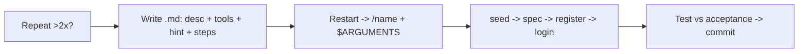

# Custom Commands & Auth

> Custom commands = saved prompts (Markdown file whose name becomes /command). Use for repeats. Demo: seed DB + auto specs + real register/login.

## 1. Intuition

Retyping "review this" daily is waste. Save once, run with `/name`. **$ARGUMENTS** (magic slot for your typed inputs) makes one file handle many values.

```bash
ls .claude/commands/seed-user.md
# expected output: file exists -> /seed-user appears after restart
```

> You can now: turn any 2x prompt into a command.

## 2. How it works

- **Rule** — filename = command. Restart after new file. Scopes: project `<repo>/.claude/commands/` (shared) vs user `~/.claude/commands/` (all projects).
  ```bash
  claude
  # expected output: restart picks up new /command
  ```
- **4-part file** — description (dropdown line), allowed-tools (e.g. Read, Bash), argument-hint (`<user_id> <count> <months>`), steps (exact order).
  ```markdown
  ---
  description: Seed dummy expenses
  argument-hint: <user_id> <count> <months>
  allowed-tools: Read, Bash(python3 *)
  ---
  # expected output: shows hints while typing
  ```
- **/seed-user** — read database.py, make Indian name/email, password always "123" hashed, unique retry, insert via `get_db()`, print. Safe: only python via Bash, no git/rm.
  ```bash
  /seed-user
  # expected output: one user printed, e.g. demo@spendly.com
  ```
- **/seed-expense 2 5 3** — parse 3 ints, verify user exists else abort, spread count over months, ranges Food 50-800, Health 100-2000, Travel 100-3000, Bills 200-5000, Shopping 100-4000 INR, print summary.
  ```bash
  /seed-expense 2 5 3
  # expected output: 5 rows for user 2 across 3 months
  ```
- **/create-spec `<n> <slug>`** — read CLAUDE.md + app.py + db.py + specs/, write `.claude/specs/<n>-<slug>.md` (Overview, Deps, Routes, DB, Templates, Files, New deps, Rules, Acceptance). Upgraded: refuse dirty tree, no branch clash, pull main, make `feature/<slug>`, then write.
  ```bash
  /create-spec 03 login-and-logout
  # expected output: branch + spec file created
  ```
- **Register** — GET /register form exists; POST adds user: fix method/action, error block, no SQLAlchemy, ? queries, hash, server checks. Tests: form shows, valid→login, mismatch→error, dup email→error, empty blocked, hash not plain. All Pass.
  ```python
  generate_password_hash(pw)
  # expected output: stored hash, not "123"
  ```
- **Login/logout** — POST /login sets `session['user_id']`, GET /logout clears, navbar Sign Out when in, guards redirect logged-in away from /login + /register (added after miss).
  ```python
  session['user_id'] = user['id']
  # expected output: stays logged across pages
  ```

> You can now: seed, spec, and ship auth without retyping.

## 3. Visual



PDF tables: 4 repeat candidates, project vs user, 4-part anatomy, seed args, guards, login diff.

## 4. Use cases

| Use case | When to use (concrete example) | When NOT to / edge case |
|---|---|---|
| Seed demo data | `/seed-expense 2 5 3` before UI demo | Seed prod DB — junk users; fix: restrict allowed-tools + local only |
| Start feature | `/create-spec 04 x` gives branch + spec | Dirty tree — mixes features; fix: guard refuses, commit first |
| Auth bug | Feed "logged-in sees /login" back, add guards | Trust spec blindly — miss item 6; fix: manual acceptance run |
| Edge case: bad args | `/seed-expense 2` missing months | Silent wrong seed; fix: validate + print usage line |

## 5. AI-era leverage

- **Command maker:** convert repeat to file.
  ```text
  Ask AI: "Turn this repeat prompt into .md with description, allowed-tools, argument-hint, 4 steps: <paste>."
  ```
- **Auth tester:** run acceptance fast.
  ```text
  Ask AI: "From this spec, make a 6-row Pass/Fail table for register. I will tick manually."
  ```

## 6. Limits & tradeoffs

- Needs restart — breaks as: command missing — instead do: exit + `claude` again.
- Over-permissive tools — breaks as: seed deletes files — instead do: `Bash(python3 *)` only.
- Spec still needs eyes — breaks as: auto = perfect — instead do: review + iterate (lesson: Iteration healthy).
- Open aspects: skills merger in [[09-Skills|09 Skills]]; orchestrate via subagents in [[10-Subagents|10 Subagents]].

## 7. Related

- [[../Claude-Code|Claude Code hub]] · [[07-Spec-Driven-Plan-Mode|07 SDD]] · [[09-Skills|09 Skills]] · [[../context/Claude-Code.resources]] · [[../context/Claude-Code.build]]
