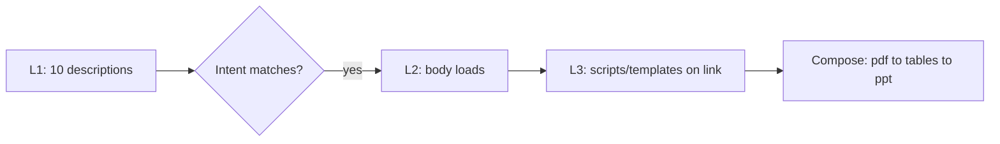

# Skills

> Skills = folders that make Claude a specialist (workflows + files on demand). Fixes 5 prompt pains: retype, context burn, no bundle, no share, no compose.

## 1. Intuition

General AI knows PowerPoint but not your fonts/layouts. **Progressive disclosure** (show info only when needed) keeps context light: Level 1 names, Level 2 body, Level 3 files.

```bash
ls .claude/skills/frontend-design/SKILL.md
# expected output: skill entry file present
```

> You can now: say when a prompt needs to become a skill.

## 2. How it works

### Problem + shape

- **Prompts don't scale** — retyped each time, 20k tokens always burn, no bundling, sharing, or composing.

  ```text
  Long prompt every time = 20k tokens burned always
  # expected output: slow + costly vs skill loads on need
  ```

- **Folder + frontmatter** — `SKILL.md` required (`name` id + `description` trigger); scripts/resources/assets optional.

  ```bash
  mkdir -p .claude/skills/ppt-generator/scripts
  # expected output: skill skeleton ready
  ```

### Loading + making

- **Three levels** — L1 descriptions always in context, L2 body on intent match, L3 files when body links them.

  ```text
  Successfully loaded skill: frontend-design
  # expected output: confirms L2 loaded
  ```

- **Personal vs project + creator** — `~/.claude` follows you, repo skills follow the team; skill-creator interviews, iterate 4–5x, restart.

  ```bash
  claude -r
  # expected output: new skill listed under /
  ```

### Proof + rules

- **Demo + merger** — same model, visibly better page with the skill; commands merged into skills, `disable-model-invocation` gates auto-fire.

  ```markdown
  ---
  disable-model-invocation: true
  ---
  # expected output: only runs when you type /name
  ```

> You can now: create, test, and gate a skill.

## 3. Visual



Also tabulated: PPT gap, 5 prompt fails, prompts vs skills, folder contents, 3 levels, personal vs project, fixes, profile diff, command vs skill triggers.

## 4. Use cases

| Use case | When to use (concrete example) | When NOT to / edge case |
|---|---|---|
| Team frontend style | `frontend-design` for every page | One-off page — skill overhead; fix: prompt only |
| EDA pack (Rahul) | Skew >1.5 flag, leakage >0.95 red | Generic EDA — misses domain; fix: encode rules in body |
| Chain tasks | make-ppt links extract-tables links read-pdf | One giant prompt — confused; fix: 3 small skills composing |
| Edge case: auto fires wrong | Skill hijacks unrelated chat | Annoying; fix: `disable-model-invocation: true` |

## 5. AI-era leverage

- **Skill drafter:** answer 3 Qs fast.

  ```text
  Ask AI: "Draft SKILL.md for <task>. Ask me: what it does, when to trigger, what done looks like. Then output frontmatter + 5 steps."
  ```

- **Share pack:** version team knowledge.

  ```text
  Ask AI: "List files for ppt-generator skill: SKILL.md + 1 script + 1 template. Give mkdir + git add commands."
  ```

## 6. Limits & tradeoffs

- 4-5 iterations to solid — breaks as: first draft flaky — instead do: test on real prompts, refine.

- Untrusted skills leak keys — breaks as: random install steals env — instead do: read SKILL.md + scripts first.

- Body stays in context after load — breaks as: long body = recurring cost — instead do: concise steps, link details to L3.

- Open aspects: distribute via [[14-Plugins-Deploy|14 Plugins]]; isolate via [[10-Subagents|10 Subagents]].

## 7. Related

- [[../Claude-Code|Claude Code hub]] · [[../context/Claude-Code.resources]] · [[../context/Claude-Code.build]]
