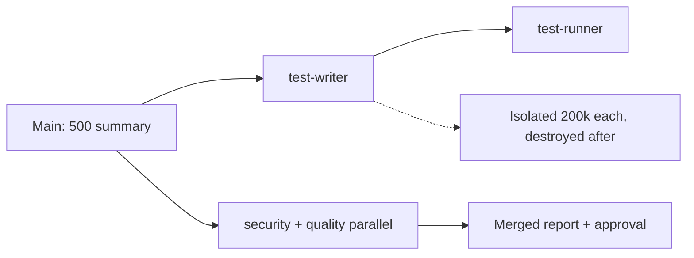

# Subagents

> Subagents = helper agents (own fresh memory workers that return a short summary then vanish). Fix stateless resend + overflow + middle-blindness. Think functions: input → output, hide insides.

## 1. Intuition

LLMs (predictors) hold nothing between calls. Apps fake memory by resending all history. For code this resends 30k files every turn. **Lost-in-the-middle** (model ignores middle of huge input) then drops key files silently.

```bash
/agents
# expected output: panel to create/view agents (newer: ask Claude directly)
```

> You can now: explain why big chats get dumb and costly.

## 2. How it works

- **Escalation math** — Turn 1 30k+. Turn 8 ~76k. 8 turns ~380k (~$1.14). Codebase needed Turn 1 only, resent always.
  ```text
  Without: 30000 + history each turn. With: 500 summary each turn. Save 29500/turn.
  # expected output: lean main chat, cheap
  ```
- **4 wins** — isolation (heavy reads elsewhere), specialization (reviewer/security/tester prompts), modularity (Explorer→Planner→Coder→Reviewer→Tester), parallelism (3 EDA agents at once).
  ```text
  Main -> subagent(search 3 datasets parallel) -> 3 summaries back
  # expected output: 1x time for 3 jobs
  ```
- **Types** — built-in always: Explore (read-only search), Plan (research for plan mode), General (complex read+write). Custom: user `~/.claude/` (all) vs project `.claude/` (team).
  ```bash
  ls .claude/agents/
  # expected output: test-writer.md test-runner.md security-reviewer.md
  ```
- **Triggers** — auto (Claude matches description, most common) vs manual (you say "use X" or slash orchestrates).
  ```text
  Use test-writer subagent for date-filter per spec 06
  # expected output: explicit run, predictable
  ```
- **Make custom** — `/agents` → new → scope → generate/Manual → description (trigger key) → tools → model → color → memory. Or hand-write `.md`. Always review generated file.
  ```markdown
  ---
  name: spendly-test-writer
  description: Use after implementing any Spendly feature to write pytest from spec, NOT code
  tools: Read, Edit, Glob, Grep
  model: sonnet
  color: red
  ---
  # expected output: file at .claude/agents/spendly-test-writer.md
  ```
- **Body rules** — job, how, inputs/outputs, must-NOTs (won't-do more vital than will-do), stack paths.
  ```text
  Tests from spec, not code. Code may be buggy, spec is truth.
  # expected output: catches real bugs, not self-praise
  ```
- **Pipelines** — Test: writer (happy, validation, HTTP codes, edges, auth) → runner (Read+Bash only, table total/pass/fail + fixes + verdict) via `/test-feature <spec>` sequential. Review: security (injection, secrets, auth, f-string SQL, CSRF) + quality (names, length, dup, docstrings) parallel via `/code-review-feature` → merged report + approval gate.
  ```bash
  /test-feature 06-date-filter-profile
  # expected output: 76 tests, 73 pass, 3 test-bugs, verdict line
  ```
- **Numbers + least privilege** — demo flagged f-string SQL, auto-fixed after ok. Writers Edit, runners Bash, reviewers Read-only. Descriptions action-specific with trigger + non-goals.
  ```bash
  /code-review-feature 06-date-filter-profile
  # expected output: security + quality report, ask before apply
  ```

> You can now: build a test + review gate that saves main context.

## 3. Visual



PDF tables: stateless calls, per-turn escalation, with/without plan tokens, SDLC agents, 6 use cases, taxonomy, built-ins, triggers, scopes, frontmatter fields, sequential vs parallel, test types, 76-test demo, auto vs slash guide.

## 4. Use cases

| Use case | When to use (concrete example) | When NOT to / edge case |
|---|---|---|
| Explore 30k repo | Explore agent returns 500-token plan | Load all in main — overflow + blind middle; fix: delegate |
| Unbiased review | Fresh reviewer (author biased) | Author reviews self — misses injection; fix: separate agent |
| Parallel EDA | 3 agents, 3 datasets at once | Sequential — 3x wait; fix: parallel flag |
| Edge case: vague description | "helps with code" fires randomly | Noise + cost; fix: "Use after X to do Y, not Z" |

## 5. AI-era leverage

- **Pipeline builder:** add gates to SDD.
  ```text
  Ask AI: "Make /test-feature that runs writer then runner for spec $ARG. Sequential, verdict table required."
  ```
- **Security net:** catch injection fast.
  ```text
  Ask AI: "Write security-reviewer body: check f-string SQL, secrets, auth. Read-only, report + fix proposal."
  ```

## 6. Limits & tradeoffs

- Extra hops for tiny tasks — breaks as: slower than direct — instead do: subagents for heavy/parallel/isolated only.
- Bad frontmatter = wrong trigger — breaks as: never/auto-misfire — instead do: specific description + review file.
- Tests from code lie — breaks as: green but wrong — instead do: spec-first rule enforced.
- Open aspects: hook guards in [[12-Hooks-Plugins-Deploy|12 Hooks]]; MCP tools per agent in [[11-MCP-Integrations|11 MCP]].

## 7. Related

- [[../Claude-Code|Claude Code hub]] · [[05-Context-Window-Management|05 Context]] · [[07-Spec-Driven-Plan-Mode|07 SDD]] · [[../context/Claude-Code.resources]] · [[../context/Claude-Code.build]]
