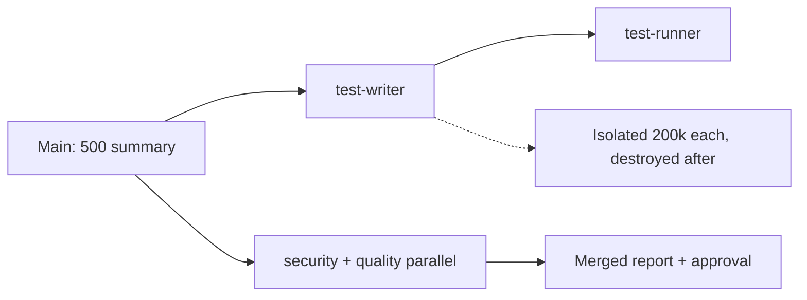

# Subagents

> Subagents = helper agents (own fresh memory workers that return a short summary then vanish). Fix stateless resend + overflow + middle-blindness. Think functions: input → output, hide insides.

## 1. Intuition

LLMs (predictors) hold nothing between calls. Apps fake memory by resending all history. For code this resends 30k files every turn. **Lost-in-the-middle** (model ignores middle of huge input) then drops key files silently.

```bash
/agents
# expected output: panel to create/view agents (newer: ask Claude directly)
```

> You can now: explain why big chats get dumb and costly.

## 2. How it works

### Foundation

- **Stateless wrapper** — each call starts empty (Paris demo); apps fake memory by resending everything.

  ```text
  Call 1: "capital of France?" -> "Paris." Call 2: "what about Germany?" -> "In what context?"
  # expected output: statelessness demonstrated, memory lives outside the model
  ```

- **Codebase math + silent dangers** — 30k resent per turn → ~380k over 8 turns; overflow drops tokens and the middle goes ignored, neither warns.

  ```text
  Without: 30000 + history each turn. With: 500 summary each turn. Save 29500/turn.
  # expected output: lean main chat, cheap
  ```

### Advantages

- **Isolation (core)** — logs and dumps stay in the helper window; only a concise summary returns.

  ```text
  Without: logs + dumps + search results = cluttered main chat.
  With: concise summary only = clean main chat.
  # expected output: same findings, ~60x fewer tokens resent per turn
  ```

- **Specialization = permissions** — Auditor gets Read + Grep (read-only); Writer gets Edit + Bash (full access); the tools list grants.

  ```yaml
  auditor: Read, Grep    # read-only, cannot change anything
  writer: Edit, Bash     # full access, can change and run
  # expected output: an auditor physically cannot edit, even if asked
  ```

- **Modularity + parallelism** — analyze→findings, implement→code, review→issues, test→results; parallel jobs finish in 1x time.

  ```text
  Sequential: Task A, then B = 2x time. Parallel: A + B + C together = 1x time.
  # expected output: independent work stops waiting on itself
  ```

### Built-ins

- **Built-ins fire themselves** — Explore (quick/medium/thorough), Plan, General-Purpose; implicit match is most common. Customs are designed separately (see next note).

  ```bash
  ls .claude/agents/
  # expected output: test-writer.md test-runner.md security-reviewer.md
  ```

> You can now: build a test + review gate that saves main context.

## 3. Visual



Also tabulated: stateless calls, per-turn escalation, with/without plan tokens, SDLC agents, 6 use cases, taxonomy, built-ins, triggers, scopes, frontmatter fields, sequential vs parallel, test types, 76-test demo, auto vs slash guide.

## 4. Use cases

| Use case | When to use (concrete example) | When NOT to / edge case |
|---|---|---|
| Explore 30k repo | Explore agent returns 500-token plan | Load all in main — overflow + blind middle; fix: delegate |
| Unbiased review | Fresh reviewer (author biased) | Author reviews self — misses injection; fix: separate agent |
| Test authorship | Writer drafts from spec, runner executes | Coder tests own code — validates what it does, not should; fix: spec-first writer |
| Multi-stage pipeline | Writer → runner sequential, reviewers parallel | One mega-agent — mixed duties, bloated context; fix: split stages |
| Security audit | Dedicated prompt hunts injection/secrets/auth | Generic reviewer — misses f-string SQL; fix: security-reviewer agent |
| Parallel EDA | 3 agents, 3 datasets at once | Sequential — 3x wait; fix: parallel flag |
| Edge case: vague description | "helps with code" fires randomly | Noise + cost; fix: "Use after X to do Y, not Z" |

## 5. AI-era leverage

- **Pipeline builder:** add gates to SDD.

  ```text
  Ask AI: "Make /test-feature that runs writer then runner for spec $ARG. Sequential, verdict table required."
  ```

- **Security net:** catch injection fast.

  ```text
  Ask AI: "Write security-reviewer body: check f-string SQL, secrets, auth. Read-only, report + fix proposal."
  ```

## 6. Limits & tradeoffs

- Extra hops for tiny tasks — breaks as: slower than direct — instead do: subagents for heavy/parallel/isolated only.

- Bad frontmatter = wrong trigger — breaks as: never fires or misfires — instead do: specific action-first description with trigger + non-goals.

- Over-permissioned agent — breaks as: reviewer with Write quietly edits code mid-review — instead do: reviewers Read-only, runners Read+Bash, writers Edit; approve fixes through the gate.

- Tests from code lie — breaks as: green but wrong — instead do: spec-first rule enforced.

- Open aspects: hook guards in [[13-Hooks-Plugins-Deploy|13 Hooks]]; MCP tools per agent in [[12-MCP-Integrations|12 MCP]].

## 7. Related

- [[../Claude-Code|Claude Code hub]] · [[../context/Claude-Code.resources]] · [[../context/Claude-Code.build]]
