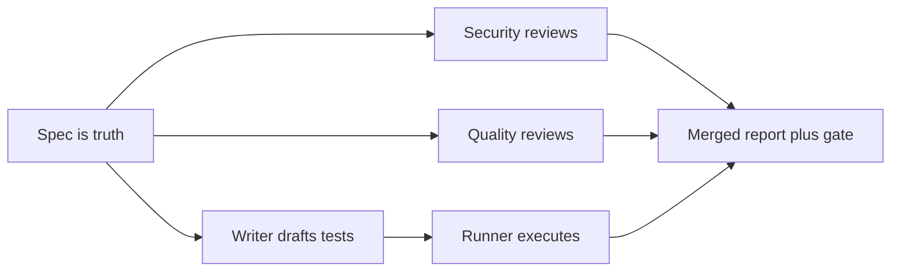

# Custom Subagents

> Built-ins are generic temps. Custom subagents are specialists hired for your codebase: your checklist, your tools, your rules — running test and review pipelines on every feature.

## 1. Intuition

A built-in agent knows code in general but not your company's compliance rules or stack taboos. A custom one does — because you wrote its orders. **Least privilege** (giving each worker only the tools its job needs) keeps it safe.

```text
Generic: "helps with code." Custom: "writes Spendly pytest from spec after every feature."
```

> You can now: say when a built-in stops being enough.

## 2. How it works

### Why + what you control

- **Built-ins are generic** — they miss company rules, codebase patterns, and stack taboos. Customs fill exactly that gap.

  ```text
  Need specialization for YOUR codebase or workflow -> build custom, not built-in.
  # expected output: correct trigger decision in one line
  ```

- **Five control surfaces** — system prompt (your checklist), tools (least privilege), skills (domain packs), model per task (Sonnet/Opus/Haiku), memory (persistent context).

  ```yaml
  writers: Read, Edit, Glob, Grep
  runners: Read, Bash        # no Write, cannot alter code
  reviewers: Read            # cannot alter anything
  # expected output: capability granted by listing, nothing more
  ```

### Write one

- **Two ways** — `/agents` guided flow (panel → create → scope → generate-or-manual → description → tools → model → color → memory → file appears) or hand-write the `.md` once you know the shape; either way, paste it back against your project — generated files are starting points.

  ```bash
  ls .claude/agents/
  # expected output: test-writer.md test-runner.md security-reviewer.md
  ```

- **Anatomy: frontmatter + body** — frontmatter holds name, description (the auto-trigger key — most important field), tools, model, color, plus optional skills/hooks/memory/effort. The body holds job, method, inputs/outputs, stack paths — and must-NOTs, which matter more than must-dos because they stop drift.

  ```markdown
  ---
  name: spendly-test-writer
  description: Use after implementing any Spendly feature to write pytest from spec, NOT code
  tools: Read, Edit, Glob, Grep
  model: sonnet
  color: red
  ---
  # expected output: file at .claude/agents/spendly-test-writer.md
  ```

- **Scopes + triggers** — project scope (`.claude/`, team-shared) vs personal (`~/.claude/`, all your repos). Auto-fire matches the description; manual fires by your order or a slash command — and real multi-step workflows use slash orchestration for predictable order.

  ```text
  Use the test-writer subagent to write tests for X
  # expected output: explicit run, predictable order
  ```

### Pipelines

- **Test runs sequential, from spec** — writer drafts happy-path, validation, HTTP, edge, and auth cases from the SPEC (never from possibly-buggy code); runner executes with Read+Bash only and reports totals, failures, warnings, verdict via `/test-feature`.

  ```bash
  /test-feature 06-date-filter-profile
  # expected output: 76 tests, 73 pass, 3 test-bugs, verdict line
  ```

- **Review runs parallel, behind a gate** — security hunts injection/secrets/auth/f-string-SQL/CSRF while quality checks naming/length/duplication/docstrings; findings merge into one report and nothing applies without your approval. Demo: the f-string catch auto-fixed only after ok; descriptions stay action-first with triggers and non-goals.

  ```bash
  /code-review-feature 06-date-filter-profile
  # expected output: security + quality report, fixes only after your ok
  ```

> You can now: design a permission-tight agent and plug it into test + review gates.

## 3. Visual



Read it: testing flows down the left in order (each step needs the last), reviews run side by side, everything lands at one approval gate.

## 4. Use cases

| Use case | When to use (concrete example) | When NOT to / edge case |
|---|---|---|
| Enforce team rules | Compliance checklist baked into prompt | Generic built-in — misses your taboos; fix: custom with must-NOTs |
| Test gate | `/test-feature <spec>` after each feature | Writer reads code — validates bugs as correct; fix: spec-only writer |
| Review gate | `/code-review-feature` before merge | Auto-apply findings — ships bad fixes; fix: approval gate |
| Parallel audits | Security + quality at once | Sequential — 2x wait for independent work; fix: parallel launch |
| Edge case: vague description | "helps with code" fires randomly | Noise + cost; fix: action-first text with trigger + non-goals |

## 5. AI-era leverage

- **Pipeline builder:** wire gates into SDD.

  ```text
  Ask AI: "Make /test-feature that runs writer then runner for spec $ARG. Sequential, verdict table required."
  ```

- **Reviewer author:** encode your checklist once.

  ```text
  Ask AI: "Write security-reviewer body: f-string SQL, secrets, auth flaws. Read-only, report plus fix proposal."
  ```

## 6. Limits & tradeoffs

- Generated files are drafts — breaks as: trusting auto-output blindly — instead do: paste back with project context, refine.

- Over-permissioned agent — breaks as: reviewer with Write edits mid-review — instead do: writers Edit, runners Read+Bash, reviewers Read-only.

- Auto-misfire — breaks as: vague description triggers randomly — instead do: action-first text with trigger + non-goals; slash for workflows.

- Open aspects: theory in [[10-Subagents|10 Subagents]]; spec-first discipline in [[07-Spec-Driven-Plan-Mode|07 SDD + Plan]].

## 7. Related

- [[../Claude-Code|Claude Code hub]] · [[../context/Claude-Code.resources]] · [[../context/Claude-Code.build]]
