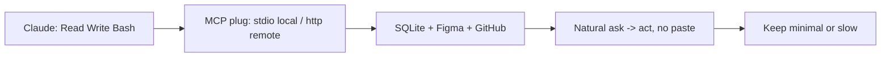

# MCP Integrations

> MCP = open plug (universal connector from Anthropic that gives Claude more tools). Before: custom fragile code per tool. After: one standard plug.

## 1. Intuition

Claude alone sees local files + shell. MCP adds GitHub, Drive, Jira, Slack, Figma, DBs, AWS. **Transport** (how plug talks: local vs remote) decides command shape.

```bash
/mcp
# expected output: lists servers, Connected or not
```

> You can now: say what MCP adds in one line.

## 2. How it works

- **Defaults vs gains** — has Read/Write/Bash. With MCP: repos/issues/PRs, docs, tickets, chats, designs, SQLite/MySQL/Postgres, cloud.
  ```text
  Without MCP: local only. With MCP: outside world readable + writable.
  ```
- **DB SQLite** — server `@executeautomation/database-server` works all 3 DBs.
  ```bash
  claude mcp add --transport stdio sqlite -- npx -y @executeautomation/database-server /absolute/path/to/spendly.db
  # expected output: /mcp shows sqlite Connected
  ```
- **DB asks** — "List tables", "Describe expenses schema", "Total by category". No Python/SQL. Good 2 tables or 20.
  ```text
  List all tables in Spendly database
  # expected output: users + expenses + schema lines
  ```
- **Transports** — stdio local process, http/sse remote host. Verify `/mcp` first. Absolute DB paths.
  ```bash
  claude mcp add --transport stdio x -- <cmd>
  claude mcp add --transport http y <url> -H "Authorization: Bearer $TOKEN"
  # expected output: Added ... lines
  ```
- **Figma** — design tool for wireframes. Install plugin (bundles server + skills): `claude plugin install figma@claude-plugins-official`. Then URL → Jinja template + navbar (logged-only) + `/analytics` guarded + active highlight. Designer→URL→code, no manual translate.
  ```text
  Read Figma <url> for Coming Soon, make analytics.html + route + navbar.
  # expected output: page matches design exactly
  ```
- **GitHub** — PAT (personal token: your key) via Settings→Developer→Fine-grained→Generate, needs repo + workflow + PR create/merge. Add remote http server. Then "most starred?", "open issues?", "open PRs?", full "commit→push→PR→squash merge→main pull→delete" in one prompt.
  ```bash
  export PAT=github_pat_xxx
  claude mcp add --transport http github https://api.githubcopilot.com/mcp -H "Authorization: Bearer $PAT"
  # expected output: github Connected
  ```
- **Top 10** — SQLite (ask DB), Figma (design→code), GitHub (full git auto), Context7 (live lib docs beats cutoff), Jira (`Read JIRA-234 implement`), Notion (PRD→scaffold), Slack (`#incidents`→fix→notify), AWS, Docker, + yours.
  ```text
  Check #incidents for latest prod error, fix bug, draft notify.
  # expected output: diagnose->fix loop from chat
  ```
- **Manage + minimal** — list `/mcp`, `claude mcp remove <name>`. Every server description loads each session → waste + slow. Keep only regulars.
  ```bash
  claude mcp remove old-server
  # expected output: server removed, context lighter
  ```

> You can now: connect one useful server and prove it with /mcp.

## 3. Visual



PDF tables: MCP facts, default tools, transports, GitHub prompts, top 10.

## 4. Use cases

| Use case | When to use (concrete example) | When NOT to / edge case |
|---|---|---|
| Understand legacy DB | "Total by category" on 20-table prod | No absolute path — fails; fix: use /absolute/...db |
| Design handoff | Figma URL → `/analytics` guarded page | No login guard — public sees private; fix: require auth in prompt |
| Incident from Slack | Read #incidents → fix → notify | 10 servers on — slow + dumb; fix: remove unused |
| Edge case: PAT without merge scope | PR merge fails | Missing checkbox; fix: enable PR create+merge at token birth, never commit PAT |

## 5. AI-era leverage

- **Docs freshener:** beat cutoff.
  ```text
  Ask AI: "Via Context7, show current Flask login syntax. Compare to my app.py and list 2 fixes."
  ```
- **Auto shipper:** one-shot git.
  ```text
  Ask AI: "Commit with conventional msg, push feature, PR with spec summary, squash merge, main pull, delete branch."
  ```

## 6. Limits & tradeoffs

- Overload hurts — breaks as: 10 plugs = token hog — instead do: minimal set, remove rest.
- Remote needs net + keys — breaks as: PAT in git = leak — instead do: env + `.gitignore`, least perms.
- Local needs absolute paths — breaks as: relative DB miss — instead do: copy full path.
- Open aspects: hook-guard MCP in [[12-Hooks-Plugins-Deploy|12 Hooks]]; plugin bundle in [[12-Hooks-Plugins-Deploy|12 Hooks]].

## 7. Related

- [[../Claude-Code|Claude Code hub]] · [[10-Subagents|10 Subagents]] · [[12-Hooks-Plugins-Deploy|12 Hooks]] · [[../context/Claude-Code.resources]] · [[../context/Claude-Code.build]]
