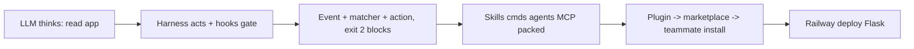

# Hooks, Plugins, Deploy

> Harness = straps that steer strong horse (software turning raw LLM into safe engineer). Hooks = auto scripts on events (deterministic guards). Plugins = pack to share setup. Deploy = Railway for Flask.

## 1. Intuition

LLM is probabilistic boss (sometimes random), harness is deterministic worker (always same). CLAUDE.md obeys ~98%, fails ~2% when tired/full. Hooks push risk to 0.

```bash
ls .claude/settings.json
# expected output: hooks live here, 3 parts inside
```

> You can now: say why instructions alone are not safety.

## 2. How it works

- **Loop + events** — cycle: read app.py → read schema → write route → pytest → done. Events: SessionStart, UserPromptSubmit, PreToolUse (before), PostToolUse (after), Stop, SubagentStart/Stop, SessionEnd.
  ```bash
  cat .claude/settings.json
  # expected output: hooks key with PreToolUse/PostToolUse blocks
  ```
- **7 uses** — format (PostToolUse, black), lint (pylint/flake8/ruff, bugs not looks), block `rm` (PreToolUse), protect `.env/*.db/migrations/secrets` (PreToolUse), notify on Stop (long 5-min jobs), telemetry (all events → dashboard), session summary (SessionStart context).
  ```bash
  pip install black
  black ${CLAUDE_PROJECT_DIR}
  # expected output: files reformatted same style
  ```
- **Anatomy 3** — Event (when), Matcher (filter: Bash, Write, `Write|Edit`, `*` all), Action (`{"type":"command","command":"python3 .claude/hooks/block-dangerous.py"}`). Exit 0 ok, 1 warn-through, 2 block. Stderr to LLM, keep fast, test with bad cmds.
  ```json
  {"hooks": {"PreToolUse": [{"matcher": "Bash", "hooks": [{"type": "command", "command": "python3 .claude/hooks/block-dangerous.py"}]}]}}
  ```
- **Block script** — read stdin JSON → `tool_input.command` → if dangerous (`rm`, `unlink`, `>`, `truncate`) AND protected (`spendly.db`, `.env`, `migrations/`) → stderr + `sys.exit(2)` else 0. `rm spendly.db` blocked, `rm tmp.txt` allowed, `cat .env` allowed.
  ```bash
  python3 .claude/hooks/block-dangerous.py < test.json
  # expected output: BLOCKED line on stderr when both match
  ```
- **Spendly 2 hooks + ship** — PostToolUse `Write|Edit` → black; PreToolUse Bash → protect list. `/ship-feature` automates commit→push→PR→merge→remote-del→main→pull→local-del. Workflow now: spec→plan→code→test→review→ship zero manual git.
  ```bash
  rm spendly.db
  # expected output: blocked by hook, LLM gets reason
  ```
- **Rahul → plugin need** — senior DS doubled output with EDA (missing heatmap, skew |s|>1.5 log, <5% rare, leakage >0.95 red), feat-eng (recency, target-encode 5-fold, VIF=1/(1-R2) drop >10), `/model-eval` (confusion, Gini=2*AUC-1, KS, SHAP), hooks (no `dropna()`, no scaler leak, no hard paths, no accuracy on imbalance), MCP tracker. Juniors need exact copy day 1, manual fragile → plugin one-install replica.
  ```text
  /plugin install rahul-ds-toolkit
  # expected output: exact skills+hooks+commands+MCP installed
  ```
- **Plugin + market** — folder with `.claude-plugin/plugin.json` (name, version, desc, author, repo, MIT; missing = invalid) + skills/hooks/commands/`.mcp.json`/agents(optional). Marketplace = GitHub repo with `marketplace.json` (app-store analogy). Official pre-installed 172; third-party add URL. `/plugin` tabs Discover/Installed/Marketplaces. Can ship subagents via `agents/`.
  ```bash
  /plugin marketplace add railwayapp/railway-skills
  /plugin install railway@railway-skills
  # expected output: 172+12=184 visible, railway ready
  ```
- **Deploy Spendly** — Delete Expense via create-spec→plan→approve→browser test→`/ship-feature`. Vercel bad for Flask (serverless per-request). Railway: account → `npm i -g @railway/cli` → `railway login` → `whoami` → add market → install (this-repo-only) → "Deploy Flask, give URL". Gotcha: SQLite wiped each redeploy (ephemeral) → Postgres/MySQL for real. Useful: Superpowers, Frontend, Context7, Simplifier, Creator, GitHub, Playwright, Supabase, Vercel, Figma, Railway. Don't install all.
  ```bash
  railway login && railway whoami
  # expected output: logged user, ready to deploy
  ```

> You can now: add one guard hook and install one plugin safely.

## 3. Visual



PDF figs: Rahul 4 customs, manual vs plugin copy, build→package→distribute→install chain, hook cheat + mental-model tables.

## 4. Use cases

| Use case | When to use (concrete example) | When NOT to / edge case |
|---|---|---|
| Format team | Black on Write/Edit from start | No matcher — runs every tool, slow; fix: `Write\|Edit` only |
| Guard secrets | Block `rm .env` + `> spendly.db` | Or-only logic — blocks `ls`; fix: AND dangerous + protected |
| Share DS stack | Plugin `rahul-ds-toolkit` for 3 juniors | Manual copy — one path wrong = broken; fix: plugin install |
| Edge case: SQLite on Railway | Demo deploys, data vanishes next push | Ephemeral FS; fix: switch Postgres before real users |

## 5. AI-era leverage

- **Guard writer:** make 98→100%.
  ```text
  Ask AI: "Write PreToolUse Bash hook blocking rm/unlink/> on .env/*.db. Exit 2 + stderr. Keep under 30 lines."
  ```
- **Deployer:** skip docs hunt.
  ```text
  Ask AI: "Deploy this Flask to Railway via plugin. Procfile, env, gunicorn, give public URL. Warn if SQLite."
  ```

## 6. Limits & tradeoffs

- Hooks run each match — breaks as: slow script stalls — instead do: tiny fast checks, stderr not stdout.
- Too many plugins cost context — breaks as: every desc loads — instead do: install mapping to workflow only.
- Vercel ≠ Flask — breaks as: serverless misfit — instead do: Railway + Postgres.
- Open aspects: full cheat in Quick Ref below; sources in [[../context/Claude-Code.resources]]; builds in [[../context/Claude-Code.build]].

## 7. Related

- [[../Claude-Code|Claude Code hub]] · [[09-Skills|09 Skills]] · [[10-Subagents|10 Subagents]] · [[../context/Claude-Code.resources]] · [[../context/Claude-Code.build]]
