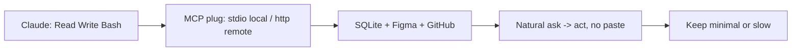

# MCP Integrations

> MCP = open plug (universal connector from Anthropic that gives Claude more tools). Before: custom fragile code per tool. After: one standard plug.

## 1. Intuition

Claude alone sees local files + shell. MCP adds GitHub, Drive, Jira, Slack, Figma, DBs, AWS. **Transport** (how plug talks: local vs remote) decides command shape.

```bash
/mcp
# expected output: lists servers, Connected or not
```

> You can now: say what MCP adds in one line.

## 2. How it works

### Plug in

- **More tools, one standard** — Read/Write/Bash alone → repos, docs, tickets, designs, DBs, cloud.

  ```text
  Without MCP: local only. With MCP: outside world readable + writable.
  ```

- **Two transports** — stdio runs local, http/sse talks remote; absolute paths, tokens, verify `/mcp` first.

  ```bash
  claude mcp add --transport stdio x -- <cmd>
  claude mcp add --transport http y <url> -H "Authorization: Bearer $TOKEN"
  # expected output: Added ... lines
  ```

### Three demos

- **SQLite + Figma + GitHub** — ask the DB in words; Figma URL becomes a guarded `/analytics` page; PAT with merge rights ships in one prompt.

  ```bash
  claude mcp add --transport stdio sqlite -- npx -y @executeautomation/database-server /absolute/path/to/spendly.db
  # expected output: /mcp shows sqlite Connected
  ```

- **Top servers, minimal count** — Context7 beats cutoffs, Jira/Notion/Slack flow in; every server taxes context, keep regulars.

  ```bash
  export PAT=github_pat_xxx
  claude mcp add --transport http github https://api.githubcopilot.com/mcp -H "Authorization: Bearer $PAT"
  # expected output: github Connected
  ```

### Manage

- **List, remove, stay lean** — `/mcp` shows status; drop the rest before they slow answers.

  ```bash
  claude mcp remove old-server
  # expected output: server removed, context lighter
  ```

> You can now: connect one useful server and prove it with /mcp.

## 3. Visual



Also tabulated: MCP facts, default tools, transports, GitHub prompts, top 10.

## 4. Use cases

| Use case | When to use (concrete example) | When NOT to / edge case |
|---|---|---|
| Understand legacy DB | "Total by category" on 20-table prod | No absolute path — fails; fix: use /absolute/...db |
| Design handoff | Figma URL → `/analytics` guarded page | No login guard — public sees private; fix: require auth in prompt |
| Incident from Slack | Read #incidents → fix → notify | 10 servers on — slow + dumb; fix: remove unused |
| Edge case: PAT without merge scope | PR merge fails | Missing checkbox; fix: enable PR create+merge at token birth, never commit PAT |

## 5. AI-era leverage

- **Docs freshener:** beat cutoff.

  ```text
  Ask AI: "Via Context7, show current Flask login syntax. Compare to my app.py and list 2 fixes."
  ```

- **Auto shipper:** one-shot git.

  ```text
  Ask AI: "Commit with conventional msg, push feature, PR with spec summary, squash merge, main pull, delete branch."
  ```

## 6. Limits & tradeoffs

- Overload hurts — breaks as: 10 plugs = token hog — instead do: minimal set, remove rest.

- Remote needs net + keys — breaks as: PAT in git = leak — instead do: env + `.gitignore`, least perms.

- Local needs absolute paths — breaks as: relative DB miss — instead do: copy full path.

- Open aspects: hook-guard MCP in [[13-Hooks|13 Hooks]]; plugin bundle in [[14-Plugins-Deploy|14 Plugins]].

## 7. Related

- [[../Claude-Code|Claude Code hub]] · [[../context/Claude-Code.resources]] · [[../context/Claude-Code.build]]
