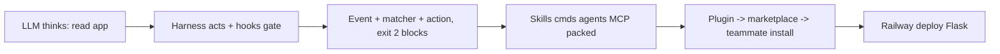

# Hooks, Plugins, Deploy

> Harness = straps that steer strong horse (software turning raw LLM into safe engineer). Hooks = auto scripts on events (deterministic guards). Plugins = pack to share setup. Deploy = Railway for Flask.

## 1. Intuition

LLM is probabilistic boss (sometimes random), harness is deterministic worker (always same). CLAUDE.md obeys ~98%, fails ~2% when tired/full. Hooks push risk to 0.

```bash
ls .claude/settings.json
# expected output: hooks live here, 3 parts inside
```

> You can now: say why instructions alone are not safety.

## 2. How it works

### Safety net

- **Horse needs harness** — LLM is the probabilistic boss, harness the deterministic worker; CLAUDE.md holds ~98%, hooks cover the 2%.

  ```bash
  cat .claude/settings.json
  # expected output: hooks key with PreToolUse/PostToolUse blocks
  ```

- **Seven jobs** — format/lint after edits, block `rm`, guard secrets, notify on finish, telemetry, session summaries.

  ```bash
  pip install black
  black ${CLAUDE_PROJECT_DIR}
  # expected output: files reformatted same style
  ```

### Anatomy

- **Event + matcher + action** — when it fires, filter (Bash, `Write|Edit`), script to run; exit 0 ok, 1 warns, 2 blocks via stderr.

  ```json
  {"hooks": {"PreToolUse": [{"matcher": "Bash", "hooks": [{"type": "command", "command": "python3 .claude/hooks/block-dangerous.py"}]}]}}
  ```

- **Block needs both** — dangerous verb AND protected target: `rm spendly.db` dies, `rm tmp.txt` lives.

  ```bash
  python3 .claude/hooks/block-dangerous.py < test.json
  # expected output: BLOCKED line on stderr when both match
  ```

### Share + ship

- **Plugin = one install** — manifest + skills/hooks/commands/MCP/agents; marketplace lists many; Rahul's stack reaches juniors day one.

  ```text
  /plugin install rahul-ds-toolkit
  # expected output: exact skills+hooks+commands+MCP installed
  ```

- **Railway over Vercel** — Flask breaks as serverless functions; Railway CLI + plugin + one prompt; SQLite wipes → Postgres for real.

  ```bash
  railway login && railway whoami
  # expected output: logged user, ready to deploy
  ```

> You can now: add one guard hook and install one plugin safely.

## 3. Visual



Pictured: Rahul 4 customs, manual vs plugin copy, build→package→distribute→install chain, hook cheat + mental-model tables.

## 4. Use cases

| Use case | When to use (concrete example) | When NOT to / edge case |
|---|---|---|
| Format team | Black on Write/Edit from start | No matcher — runs every tool, slow; fix: `Write\|Edit` only |
| Guard secrets | Block `rm .env` + `> spendly.db` | Or-only logic — blocks `ls`; fix: AND dangerous + protected |
| Share DS stack | Plugin `rahul-ds-toolkit` for 3 juniors | Manual copy — one path wrong = broken; fix: plugin install |
| Edge case: SQLite on Railway | Demo deploys, data vanishes next push | Ephemeral FS; fix: switch Postgres before real users |

## 5. AI-era leverage

- **Guard writer:** make 98→100%.

  ```text
  Ask AI: "Write PreToolUse Bash hook blocking rm/unlink/> on .env/*.db. Exit 2 + stderr. Keep under 30 lines."
  ```

- **Deployer:** skip docs hunt.

  ```text
  Ask AI: "Deploy this Flask to Railway via plugin. Procfile, env, gunicorn, give public URL. Warn if SQLite."
  ```

## 6. Limits & tradeoffs

- Hooks run each match — breaks as: slow script stalls — instead do: tiny fast checks, stderr not stdout.

- Too many plugins cost context — breaks as: every desc loads — instead do: install mapping to workflow only.

- Vercel ≠ Flask — breaks as: serverless misfit — instead do: Railway + Postgres.

- Open aspects: full cheat in Quick Ref below; sources in [[../context/Claude-Code.resources]]; builds in [[../context/Claude-Code.build]].

## 7. Related

- [[../Claude-Code|Claude Code hub]] · [[../context/Claude-Code.resources]] · [[../context/Claude-Code.build]]
