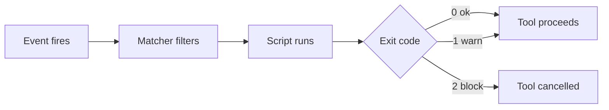

# Hooks

> The LLM is a probabilistic boss who is right ~98% of the time. Hooks are deterministic guards that cover the other 2% — small scripts the harness must run, no matter what the model decides.

## 1. Intuition

CLAUDE.md asks nicely; hooks enforce. A **harness** (control straps turning a raw strong model into a safe engineer) runs your script at exact lifecycle moments — before a tool runs, after it finishes, when work ends.

```text
Instruction: "never touch .env" = request. PreToolUse hook blocking it = guarantee.
```

> You can now: say why instructions alone can never promise safety.

## 2. How it works

### Concept

- **Horse needs harness** — the model thinks ("read app.py") and the harness acts (reads, writes, runs tests, asks permission, tracks context, spawns subagents). Raw power only becomes reliable through that structured layer.

  ```bash
  cat .claude/settings.json
  # expected output: hooks key with PreToolUse/PostToolUse blocks
  ```

- **Moments to latch onto** — session start, each prompt you submit, just-before and just-after every tool call, response end, subagent start and stop, session close. Name the moment, and your script runs there automatically.

  ```text
  SessionStart -> UserPromptSubmit -> PreToolUse -> PostToolUse -> Stop
  # expected output: the lifecycle your hooks can grip
  ```

### Build

- **Seven jobs** — format code after edits (Black), lint for real bugs not looks, block destructive shell commands, shield secrets and databases, ping you when long jobs finish, stream telemetry to dashboards, inject project summaries at session start.

  ```bash
  pip install black
  black ${CLAUDE_PROJECT_DIR}
  # expected output: files reformatted same style
  ```

- **Event + matcher + action** — every hook names WHEN it fires, a FILTER narrowing it (Bash only, `Write|Edit`, or everything), and a COMMAND (usually a script). It answers in exit codes: 0 means fine, 1 warns but proceeds, 2 cancels — complaints go on stderr so the model reads them.

  ```json
  {"hooks": {"PreToolUse": [{"matcher": "Bash", "hooks": [{"type": "command", "command": "python3 .claude/hooks/block-dangerous.py"}]}]}}
  ```

- **Block needs both** — the course's specimen script reads the harness JSON, pulls the pending command, and blocks only on dangerous verb AND protected target together: `rm spendly.db` dies, while `rm tmp.txt` and `cat .env` pass untouched.

  ```bash
  python3 .claude/hooks/block-dangerous.py < test.json
  # expected output: BLOCKED line on stderr when both match
  ```

### Run + maintain

- **Spendly pair + ship** — Black reformats every Write/Edit after the fact; the protector guards Bash before the fact; `/ship-feature` collapses commit→push→PR→merge→cleanup into one call. Daily flow becomes spec→plan→code→test→review→ship with zero manual git.

  ```bash
  rm spendly.db
  # expected output: blocked by hook, LLM gets reason
  ```

- **Keep them healthy** — install on day one (safeguards, not afterthoughts), always filter narrowly, AND your conditions, write to stderr never stdout, probe with deliberately bad commands, keep scripts tiny since they run constantly.

  ```text
  Maintenance loop: break it on purpose -> read stderr -> shrink matcher -> re-test.
  # expected output: guards you trust because you watched them fire
  ```

> You can now: add one guard hook and prove it blocks.

## 3. Visual



Read it: the harness, not the model, walks this chain — that is what makes the outcome deterministic.

## 4. Use cases

| Use case | When to use (concrete example) | When NOT to / edge case |
|---|---|---|
| Auto-format team | Black on `Write|Edit` from day one | No matcher — runs on every tool, slow; fix: filter `Write|Edit` |
| Guard secrets + DB | Block `rm`/`>` on `.env`, `*.db`, `migrations/` | OR-only logic — blocks innocent `ls`; fix: dangerous AND protected |
| Long-task ping | Notify on Stop, walk away 10 min | Ping on every turn — noise; fix: Stop event only |
| Telemetry board | All events stream to a dashboard | Heavy script per event — stalls chat; fix: tiny emitters |
| Morning context | SessionStart summary: done, pending, last state | Giant dump — burns context; fix: 5-line summary |
| Lint after edits | Catch unused imports, typos, bare excepts | Format-only thinking — looks ≠ bugs; fix: run both |
| Edge case: stdout chatter | Script prints to stdout | Pollutes tool results; fix: stderr for model, stdout only for JSON control |

## 5. AI-era leverage

- **Guard writer:** turn the 98 into 100.

  ```text
  Ask AI: "Write PreToolUse Bash hook blocking rm/unlink/> on .env/*.db. Exit 2 + stderr. Keep under 30 lines."
  ```

- **Day off-loader:** reclaim waiting time.

  ```text
  Ask AI: "Add a Stop hook that desktop-notifies me with the task name when Claude finishes. macOS first."
  ```

## 6. Limits & tradeoffs

- Hooks run constantly — breaks as: slow script stalls every matching call — instead do: tiny fast checks only.

- Wrong channel — breaks as: model never sees stdout chatter — instead do: errors to stderr, stdout reserved for JSON control.

- Instructions still needed — breaks as: hooks for style guidance — instead do: CLAUDE.md teaches, hooks guarantee.

- Open aspects: test/review gates in [[11-Custom-Subagents|11 Custom]]; full automation with [[14-Plugins-Deploy|14 Plugins]].

## 7. Related

- [[../Claude-Code|Claude Code hub]] · [[../context/Claude-Code.resources]] · [[../context/Claude-Code.build]]
