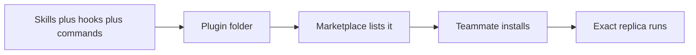

# Plugins + Deploy

> One expert's tuned setup — skills, hooks, commands, subagents, servers — packed as a single installable folder. Plugins are how agentic coding scales past the individual to the whole team.

## 1. Intuition

Hand-copying a dozen config files onto every teammate's machine breaks on the first wrong path. A **plugin** (your whole customization bundled as one unit) plus a **marketplace** (a catalog listing many such units, like an app store) turns onboarding into one command.

```text
/plugin install rahul-ds-toolkit
# expected output: exact skills+hooks+commands+MCP installed
```

> You can now: say why sharing beats copying.

## 2. How it works

### Story

- **Rahul's 2x setup** — a senior data scientist doubled output by specializing everything: an EDA skill (missing-value heatmaps, skew flags past 1.5, leakage alarms past 0.95), a feature-engineering skill (recency features, 5-fold target encoding, VIF drop past 10), a one-shot `/model-eval` (confusion matrix, Gini, KS, SHAP), leakage-catching hooks, and an experiment-tracker MCP. Credit models decide loans, so each rule guards real money.

  ```text
  Gini = 2*AUC - 1, VIF drop when > 10, flag skew when |skew| > 1.5
  # expected output: domain rules a generic model never knows
  ```

- **Copy problem** — three juniors need that exact setup on day one: skills, hooks, commands, MCP config, memory files. One missing file or path and their setup silently differs — so the whole thing ships as one plugin instead.

  ```text
  Manual copy: fragile, drifts. Plugin install: exact replica, versioned.
  # expected output: juniors productive from day one
  ```

### Package

- **Folder + manifest** — a plugin is a folder of everything you built, with a required `.claude-plugin/plugin.json` (name, version, description, author — missing means Claude Code refuses it as invalid) plus skills, hooks, commands, MCP config, and optionally subagents in `agents/`.

  ```json
  {"name": "rahul-ds-toolkit", "version": "1.0.0", "description": "Credit-risk DS stack"}
  # expected output: recognized as a valid plugin
  ```

- **Marketplace + install** — a marketplace is just a GitHub repo with a `marketplace.json` listing plugins. Anthropic's official one ships 172 plugins pre-installed; third-party ones join by pasting their URL; `/plugin` browses Discover, Installed, and Marketplaces tabs (172 + 12 = 184 after adding one).

  ```bash
  /plugin marketplace add railwayapp/railway-skills
  /plugin install railway@railway-skills
  # expected output: railway ready in this repo
  ```

### Ship + maintain

- **Railway over Vercel** — Vercel runs Flask as per-request serverless functions, which breaks it; Railway hosts the app properly. Flow: account → install CLI → login → add marketplace → install plugin (this-repo-only) → one deploy prompt → public URL. Memorize the gotcha: Railway's filesystem is ephemeral, so SQLite wipes on every redeploy — real data needs Postgres or MySQL.

  ```bash
  railway login && railway whoami
  # expected output: logged user, ready to deploy
  ```

- **Curate, don't hoard** — version the manifest so teams update cleanly, choose user scope (just you, everywhere) vs repo scope (everyone, one project), and prune: every installed plugin's descriptions load into each session, so dozens of them tax context — install only your actual workflow (Superpowers, Frontend, Context7, GitHub, Railway…).

  ```text
  Maintenance loop: bump version -> team updates -> prune unused plugins.
  # expected output: shared stack stays fast instead of rotting
  ```

> You can now: pack a workflow, publish it, and deploy through it.

## 3. Visual



Read it: build once on the left, everyone else joins on the right with one command.

## 4. Use cases

| Use case | When to use (concrete example) | When NOT to / edge case |
|---|---|---|
| Onboard juniors | One plugin = senior's stack day one | Manual copy — one wrong path, silent drift; fix: versioned plugin |
| Finish Spendly | Delete-Expense via spec→plan→ship | Skip browser test — ships broken UI; fix: test before `/ship-feature` |
| Deploy Flask demo | Railway plugin, one prompt, public URL | Vercel for Flask — serverless misfit; fix: Railway + Postgres |
| Design handoff at scale | Figma plugin for the team | Solo one-off page — plugin overhead; fix: paste URL directly |
| Daily DS grind | `/model-eval` after every training run | Rebuild plots by hand each time; fix: command does matrix+Gini+KS+SHAP |
| Edge case: data vanishes | SQLite on Railway redeploys clean | Demo data gone live; fix: switch Postgres before real users |
| Edge case: plugin bloat | 20 plugins "just in case" | Slow dull answers; fix: keep workflow-mapped ones only |

## 5. AI-era leverage

- **Packager:** turn your setup into team leverage.

  ```text
  Ask AI: "Pack my .claude/skills, hooks, and /model-eval into a plugin: manifest, folder tree, marketplace.json entry."
  ```

- **Deployer:** skip the docs hunt.

  ```text
  Ask AI: "Deploy this Flask to Railway via plugin. Procfile, env, gunicorn, public URL. Warn if SQLite."
  ```

## 6. Limits & tradeoffs

- Plugins run as you — breaks as: unreviewed third-party code with your privileges — instead do: read manifest + hooks + scripts before installing.

- Too many cooks — breaks as: every description loads every session — instead do: install mapped-to-workflow only, prune quarterly.

- Serverless misfit — breaks as: Flask on Vercel — instead do: Railway (or any long-lived host) + Postgres.

- Open aspects: pack [[09-Skills|09 Skills]] + [[11-Custom-Subagents|11 Custom]] + MCP [[12-MCP-Integrations|12 MCP]]; guard with [[13-Hooks|13 Hooks]].

## 7. Related

- [[../Claude-Code|Claude Code hub]] · [[../context/Claude-Code.resources]] · [[../context/Claude-Code.build]]
