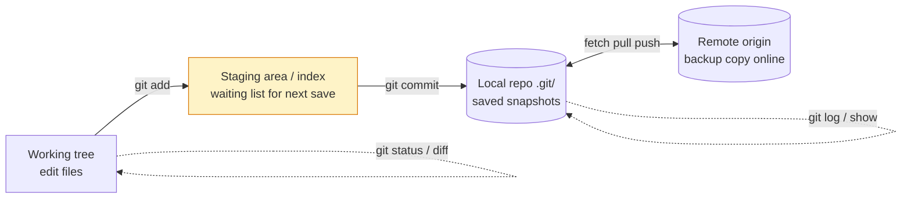

# Git Fundamentals

> Git saves snapshots of your project on your own machine. Learn this and you can start a project, save progress, and check what changed — without breaking anything.

## 1. Intuition

Three places, one loop. Your **working tree** (the files you edit) is your desk. The **staging area** (also called the **index** — a waiting list for the next save) is the photo frame — only framed files get saved. The **local repository** (the hidden `.git/` folder — Git's album) holds every save. A **remote** (another copy on a server, usually called `origin`) is just a backup album online.

```bash
echo "hello" > app.py
git status --short        # you should see: ?? app.py (untracked = new, unsaved)
git add app.py
git commit -m "add app"
git log --oneline -3      # you should see your commit at the top
```

> You can now: explain where your files are (desk, frame, or album) with one command.

## 2. How it works

- **Git vs hosting.** Git runs on your machine and saves history. GitHub/GitLab are websites for sharing + reviews. `gh`/`glab` (terminal tools for those sites) never replace `git`.

  ```bash
  git --version             # Git itself
  gh --version              # GitHub's terminal tool (needs separate install)
  ```

- **The three steps.** Edit files → `git add` (desk → frame) → `git commit` (frame → album).

  ```bash
  echo "fix" >> app.py
  git status --short       # you should see:  M app.py (modified, not framed yet)
  git add app.py
  git status --short       # you should see: M  app.py (framed, ready to save)
  git commit -m "fix login"
  # you should see: [main abc1234] fix login
  ```

- **Check before you save.** `git diff` shows desk-vs-frame. `git diff --staged` shows frame-vs-last-save.

  ```bash
  git diff                  # what you edited but didn't frame yet
  git diff --staged         # what is framed and will go into the next save
  ```

- **Look at past saves.** `git log` lists saves. `git show` opens one save fully.

  ```bash
  git log --oneline -5      # last 5 saves, one line each
  git show HEAD --stat      # what the newest save changed
  ```

- **Tell Git who you are.** Every save stores your name + email. Wrong email = your work shows as "unknown" on GitHub.

  ```bash
  git config --global user.name "Your Name"
  git config --global user.email "you@example.com"
  git config --list --show-origin | grep user
  ```

- **Settings have layers.** Machine < your account < this project < one-time flag. Project wins.

  ```bash
  git config --list --show-origin   # shows every setting + which file it came from
  ```

- **New project vs joining one.** `git init` starts history here. `git clone <url>` copies someone's full history + sets up the backup link.

  ```bash
  git init my-app && cd my-app        # start fresh
  git clone https://github.com/org/repo.git   # join existing
  ```

- **Skip junk files.** `.gitignore` lists files Git should never track (passwords, `node_modules/`). It cannot ignore files you already saved — untrack those first.

  ```bash
  echo ".env" >> .gitignore
  echo "node_modules/" >> .gitignore
  git check-ignore -v .env            # checks: is this path ignored, and by which line?
  git rm --cached .env                # stop tracking a file you already saved (keeps your copy)
  ```

- **Shortcuts.** Aliases save typing for commands you run 50× a day.

  ```bash
  git config --global alias.st status
  git config --global alias.lg "log --oneline --graph --decorate -10"
  git st
  git lg
  ```

> You can now: start or join a project, frame changes, save, and inspect the save.

## 3. Visual



Daily loop to memorize: `status` → `add -p` → `diff --staged` → `commit` → `log --oneline -5`.

## 4. Use cases

| Use case | When to use (concrete example) | When NOT to / edge case |
|---|---|---|
| Start fresh | `git init`, set name/email, first commit, then `gh repo create --source=. --push` | History already exists — `clone` instead of `init` |
| Join a project | `git clone <url>`, then `git status` + `git log --oneline -5` | You only need one folder — ask about sparse checkout (see 06) |
| Daily edits | `status` → `add -p` (picks pieces interactively) → `commit -m "verb + what"` | Unrelated changes in one file — split into 2+ commits, don't bundle |
| Review before saving | `git diff`, `git diff --staged`, `git show HEAD --stat` | After you pushed — review in the PR page, not local diff |
| Ignore noise | `.gitignore` + `git check-ignore -v <path>` to debug | File already saved — `.gitignore` won't help until `rm --cached` |
| Edge case: saved a password | Happens when `.env` was committed before `.gitignore` | Fix: `git rm --cached .env`, add to `.gitignore`, change the password (old copies live on in history) |

## 5. AI-era leverage

- **Before giving code to an AI agent:** save the clean state so bad output is one undo away.

  ```bash
  git status --short && git commit -am "checkpoint before agent"
  ```

  ```text
  Ask AI: "My working tree is clean at this commit. Change only app.py's login function, then show me git diff."
  ```

- **After agent output:** check size first, content second — agents mix refactors into fixes.

  ```bash
  git diff --stat && git diff
  ```

## 6. Limits & tradeoffs

- Git is great for text, bad for big binaries (photos, videos, model weights) — every version is kept forever. Instead: keep them in LFS (see 06).

  ```bash
  git lfs track "*.psd"   # preview of the fix, full steps in 06
  ```

- `commit -a` skips the frame (saves all tracked edits at once). Fast but can bundle unrelated edits by accident — instead use `add -p` when files hold mixed work.

- Saves are local until pushed — unpushed work dies with your disk. Push daily.

- Open aspects: what a commit really contains lives in [[02-Commits-History|02 Commits & History]]; sharing work in [[03-Branches-Remotes|03 Branches & Remotes]]. Detail sources in [[../context/Git.resources]]; proof in [[../context/Git.build]].

## 7. Related

- [[../Git|Git hub]] · [[../context/Git.resources]] · [[../context/Git.build]]
