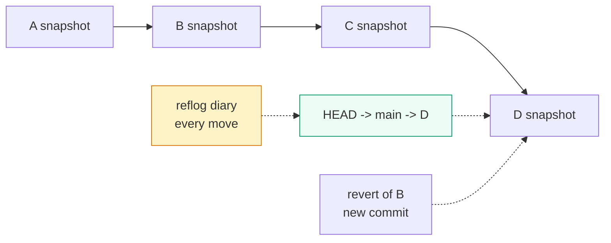

# Commits & History

> A commit is one save: a snapshot + who/when/why + a link to the previous save. Learn this and you can read history, compare saves, fix the last save, and recover anything you thought was lost.

## 1. Intuition

Each commit is a full photo of the project (not just the changes), with a caption (message, author, date) and tape to the previous photo (parent link). Fixing history means: `amend` (re-take the last photo — only if nobody else saw it), `reset` (move your bookmark back — private work only), `revert` (take a new photo that undoes an old one — safe even after sharing), `reflog` (a diary of every bookmark move — your safety net for ~90 days).

```bash
git log --oneline -5
# you should see: abc1234 fix login / def5678 add app / ...
git show HEAD --stat
# you should see: which files the newest save touched
```

> You can now: say what a commit holds and open any save to inspect it.

## 2. How it works

- **What's inside a save.** An ID (hash — a fingerprint of the content), parent link, full file snapshot, author vs committer, message.
  ```bash
  git show abc1234 --stat     # everything about one save
  ```

- **Fix the last save (private only).** `--amend` re-takes it with a new fingerprint. Never amend after pushing — teammates still hold the old fingerprint.
  ```bash
  git add forgotten.py
  git commit --amend --no-edit   # folds the file into the last save, keeps message
  ```

- **Read history.** Start narrow, widen only if needed.
  ```bash
  git log --oneline --graph --decorate -10   # last 10, with branches shown
  git log --oneline -- author@example.com    # only one person's saves
  git show HEAD~2:app.py                     # what app.py looked like 2 saves ago
  ```

- **Compare two points.** Same command, different pairs.
  ```bash
  git diff --stat HEAD~1 HEAD    # summary: what did the last save change?
  git diff main...feature --stat # summary: what would this branch add?
  git blame -L 40,60 app.py     # who last touched each of these lines (and which save)
  ```

- **`reset` = move your bookmark (private only).** Three strengths: keep everything, keep file edits, or drop all.
  ```bash
  git reset --soft HEAD~1   # undo last save, keep framed + edited files
  git reset --mixed HEAD~1  # undo last save, keep edited files, unframe all
  git reset --hard HEAD~1   # undo last save AND delete all unframed edits (dangerous)
  ```

- **`revert` = safe undo (works after sharing).** Adds a new save that undoes an old one. History stays honest.
  ```bash
  git revert abc1234         # creates a new save that undoes abc1234
  git log --oneline -3       # you should see the revert at the top
  ```

- **Rule of thumb.** Shared (pushed) → only `revert`. Never pushed → `reset`/`amend` allowed.
  ```bash
  git status -sb   # shows: are you ahead of the backup? if "ahead 2", still private
  ```

- **Lost something? Check the diary.** `reflog` (reference log — Git's diary of every move your bookmark made) lists even deleted commits.
  ```bash
  git reflog -10
  git branch recovery abc1234   # bring a lost save back as a branch
  ```

> You can now: pick the right undo (`amend` / `reset` / `revert` / `reflog`) for where the mistake lives.

## 3. Visual



Undo chooser: uncommitted file → `restore`; framed file → `restore --staged`; local save → `reset`; pushed save → `revert`; lost anything → `reflog`.

## 4. Use cases

| Use case | When to use (concrete example) | When NOT to / edge case |
|---|---|---|
| Fix last message/files | `commit --amend` right after a local save | After push — teammates saw it; use a new fixup save or `revert` |
| Review a feature | `log --oneline main..feature` + `diff main...feature --stat` | Giant `log -p` dumps — filter by file/author first |
| Find who broke a line | `git blame -L 40,60 app.py`, then `show <id>` for the reason | Don't use it to punish — use it to find the reasoning save |
| Unframe, keep edits | `git reset app.py` (frame back to last save, edits kept) | When you want edits gone too — that's `restore app.py` |
| Drop local saves | `reset --soft/mixed/hard HEAD~2` by what to keep | On a shared branch — `revert` instead |
| Undo a pushed bug | `git revert <id>` + push | History must look perfectly clean — needs a coordinated rewrite instead |
| Edge case: `reset --hard` wiped work | Happens when unframed edits existed — they are gone, no diary for unsaved edits | Fix: nothing recovers unsaved edits. Prevention: `stash` or commit before any `--hard` |

## 5. AI-era leverage

- **Before accepting agent output:** check size first (agents inflate changes), content second.
  ```bash
  git diff --stat && git diff
  ```
  ```text
  Ask AI: "Summarize this diff in 5 bullets: files changed, why, and what tests prove it."
  ```
- **After a bad agent run:** one command back to the last save (uncommitted mess) or pre-merge state.
  ```bash
  git reset --hard HEAD         # drop uncommitted mess
  git reset --hard ORIG_HEAD    # undo a bad merge/rebase (ORIG_HEAD = position before it)
  ```

## 6. Limits & tradeoffs

- `amend`/`reset` rewrite fingerprints — every copy (teammates, PRs) desyncs. Local-only tools. Instead after sharing: `revert`.
- `log` hides other branches unless asked — instead run with `--all` when hunting.
  ```bash
  git log --oneline --graph --decorate --all -15
  ```
- `reflog` is local and expires (~90 days) — mistakes already pushed need server-side recovery, not reflog.
- Next: parallel lines of saves in [[03-Branches-Remotes|03 Branches & Remotes]]; combining them in [[04-Merge-Rebase|04 Merge & Rebase]]. Sources in [[../context/Git.resources]]; proof in [[../context/Git.build]].

## 7. Related

- [[../Git|Git hub]] · [[01-Fundamentals|01 Fundamentals]] · [[03-Branches-Remotes|03 Branches]] · [[05-Undo-Recovery|05 Undo]] · [[DevOps|DevOps MOC]] · [[../context/Git.resources]] · [[../context/Git.build]]
