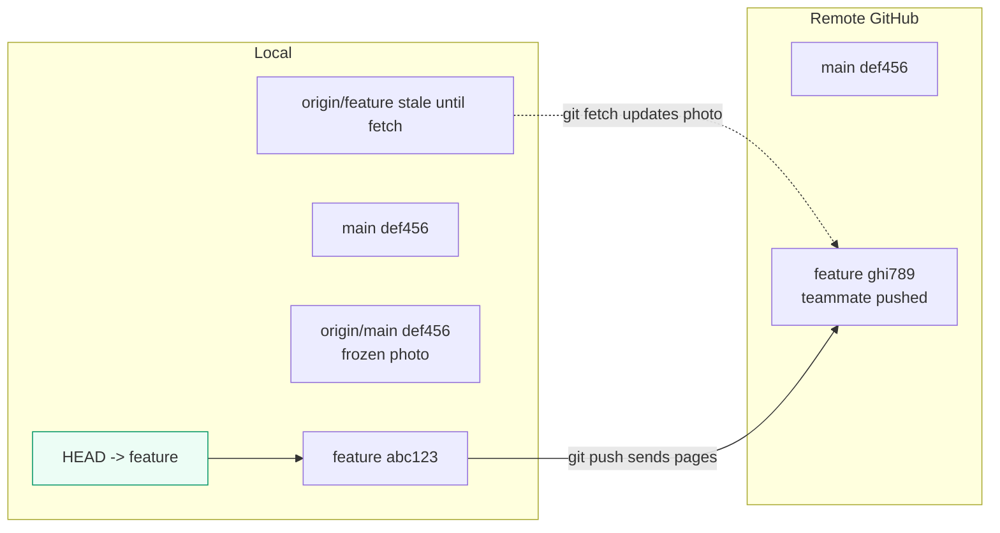

# Branches & Remotes

> A branch is a movable label on a save. Learn this and you can work on features without touching the stable code, and sync with teammates without losing work.

## 1. Intuition

History is a chain of saves. A **branch** (`main`, `feature-x`) is a sticky note on one save that slides forward with each new commit — cheap, because it stores one ID, not copies. **HEAD** (your "you are here" arrow) points at your current branch. A **remote** (a nickname like `origin` for another copy online) plus **remote-tracking branches** (`origin/main` — frozen photos of their labels, updated only by network commands) connect you to teammates.

```bash
git switch -c feature-login     # new sticky note on your current save
git commit -am "add login"       # note slides forward with your save
git push -u origin feature-login  # copy to GitHub; -u links yours to theirs (upstream)
```

> You can now: make a branch, save on it, and link it to the backup copy.

## 2. How it works

- **Branches are just labels.** Creating/deleting moves the label, never the saves (deleted labels are recoverable).

  ```bash
  git branch                    # list labels (* = where HEAD points)
  git switch -c my-feature      # create + move HEAD onto it
  git branch -d my-feature      # delete (only if merged — safe)
  git branch -m old new         # rename
  ```

- **Know where you are.** `HEAD` (current position) plus shortcuts for "N steps back".

  ```bash
  git status -sb                # shows branch + ahead/behind the backup
  git switch main               # move HEAD to main
  git switch --detach abc1234   # read-only time travel (detached HEAD = arrow on a raw save, not a branch)
  ```

- **Link yours to theirs (upstream).** Upstream (the tracked pair: your branch ↔ their branch) lets `pull`/`push` work with no extra typing.

  ```bash
  git push -u origin my-feature
  git branch -vv                 # shows every branch + its upstream + ahead/behind
  ```

- **Three copies, don't mix them up.** Your `main` (yours) vs `origin/main` (their last-seen state, frozen until you check) vs their actual `main` online. Most sync mistakes come from trusting the frozen photo.

  ```bash
  git fetch --prune             # refresh all frozen photos (safe — touches nothing of yours)
  git log --oneline main..origin/main   # what's new over there that you lack?
  ```

- **`fetch` = safe look.** Downloads + updates photos. Never conflicts, never touches your work.

  ```bash
  git fetch --all --prune
  ```

- **`pull` = look + combine.** `pull` fetches then merges into you. It can conflict — `fetch` cannot.

  ```bash
  git pull --rebase              # replay your saves on top of theirs (cleaner for features)
  ```

- **`push` = send yours over.** Rejected means someone moved first — look, combine, retry. Force-rewrite their label only with the safe flag, and only after telling the team.

  ```bash
  git push origin my-feature
  git push --force-with-lease    # rewrite only if nobody else pushed since (safe force)
  ```

> You can now: run the sync loop — `fetch` → check what's new → `pull --rebase` → `push`.

## 3. Visual



Sync loop: `fetch` → `log --oneline main..origin/main` (what's new?) → `pull --rebase` or `merge` → `push`.

## 4. Use cases

| Use case | When to use (concrete example) | When NOT to / edge case |
|---|---|---|
| New feature | `switch -c feature` from fresh `main`, push with `-u` | Directly on `main` — no review trail, blocks releases |
| Check teammate's work | `fetch`, then `log origin/theirs --oneline -5` or checkout detached (safe, read-only) | `pull` into a dirty workspace — stash/commit first |
| Daily sync | `fetch --prune` → `pull --rebase` on feature branches | `pull` with conflicts pending + uncommitted work — clean up first |
| Contribute via fork | `remote add upstream <original>`, `fetch upstream`, branch off `upstream/main` | Pushing to `upstream` directly — push to your fork, open a review |
| Edge case: push rejected | Happens when a teammate pushed first — your backup is behind | Fix: `git fetch`, `git pull --rebase`, resolve, `git push` (never bare `--force` on shared branches) |
| Edge case: deleted label, need it back | Happens after `branch -D` on unmerged work | Fix: `git reflog` → find the save ID → `git branch recovery <id>` |

## 5. AI-era leverage

- **One branch per agent task** — the agent's mess stays caged, review is one diff.

  ```bash
  git switch -c agent-task-1
  git diff main...agent-task-1 --stat   # what did the agent actually touch?
  ```

  ```text
  Ask AI: "My branch is agent-task-1 off main. List every file you changed and why, in 5 bullets."
  ```

- **10-second audit** — agents leave stray branches and half-detached states.

  ```bash
  git branch -vv && git status -sb
  ```

## 6. Limits & tradeoffs

- Plain `pull` merges by default (adds merge bubbles to history). Teams often prefer `pull --rebase` on features, merge on `main`. Check your repo's rule first.

- `origin/main` is stale by design — never trust it without a fresh `fetch`.

  ```bash
  git fetch --prune && git log --oneline main..origin/main
  ```

- Force-push rewrites shared truth — `--force-with-lease` (fails if someone else pushed) is the only acceptable kind on shared repos.

- Next: combining branches in [[04-Merge-Rebase|04 Merge & Rebase]]; fixing sync mistakes in [[05-Undo-Recovery|05 Undo & Recovery]]. Sources in [[../context/Git.resources]]; proof in [[../context/Git.build]].

## 7. Related

- [[../Git|Git hub]] · [[../context/Git.resources]] · [[../context/Git.build]]
