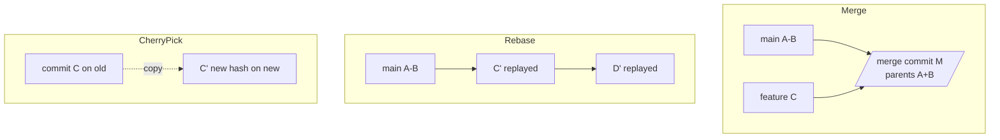

# Merge & Rebase

> Three ways to combine work. **Merge** keeps history as it happened. **Rebase** rewrites yours into a clean straight line. **Cherry-pick** copies one save elsewhere. Learn this and you can land features without fearing conflicts.

## 1. Intuition

Merging ties two ropes with a knot (a merge save with two parents — honest, chronological). Rebasing unties your rope and re-ties each of your knots on top of the other rope's end (straight line, clean, but new fingerprints). Cherry-picking photocopies one knot onto your rope (same change, new fingerprint). **Fast-forward** (no knot needed — your end already contains theirs, the label just slides) is the easy case. A conflict means both sides changed the same lines — you pick the truth.

```bash
git switch main && git merge feature        # tie the knot
git switch feature && git rebase main       # replay yours on top of main
git cherry-pick abc1234                     # copy one save here
```

> You can now: say which combiner fits (shared truth → merge, private cleanup → rebase, one save elsewhere → cherry-pick).

## 2. How it works

- **Merge.** Run it on the branch that should receive the work. Never merge with unsaved edits lying around.
  ```bash
  git switch main
  git merge feature            # fast-forward if possible, knot if diverged
  git merge --abort            # bail out mid-conflict, back to pre-merge state
  ```

- **Conflicts look like this.** Markers show both versions. Fix the file, frame it, finish.
  ```bash
  git status                   # lists files with conflicts
  # edit the file: keep yours, theirs, or a mix; delete the <<<<< ===== >>>>> lines
  git add fixed.py
  git commit                   # seals the knot (merge) — or: git rebase --continue (rebase)
  git diff --check             # catches leftover marker lines
  ```

- **Rebase (private branches only).** Replays your saves onto a new base. Never rebase shared `main` — every teammate's copy desyncs.
  ```bash
  git switch feature
  git rebase main
  git rebase --continue        # after fixing a conflict + git add
  git rebase --abort           # give up, restore pre-rebase state
  ```

- **Clean up with interactive rebase.** Rewrite messages, squash (fold many saves into one), drop, reorder.
  ```bash
  git rebase -i HEAD~3
  # in the editor: pick / reword / squash / fixup / drop — then save and exit
  ```

- **Cherry-pick (copy one save).** Result is a new fingerprint (same change, new parent).
  ```bash
  git cherry-pick abc1234
  git cherry-pick --no-commit abc1234 def5678   # stage several, commit once yourself
  ```

- **After any rewrite, push safely.** Rewritten fingerprints need a force-push — the safe kind only, after telling the team.
  ```bash
  git push --force-with-lease
  ```

- **Safety nets.** Every dangerous op leaves a way back.
  ```bash
  git reset --hard ORIG_HEAD   # ORIG_HEAD = position before the last merge/rebase
  git reflog -5                # find the pre-op save if ORIG_HEAD is gone
  ```

> You can now: combine branches, resolve a conflict start-to-finish, and back out safely.

## 3. Visual



Decision tree: shared branch? → merge. Private + messy? → interactive rebase. One save elsewhere? → cherry-pick.

## 4. Use cases

| Use case | When to use (concrete example) | When NOT to / edge case |
|---|---|---|
| Update feature with main | `rebase main` (private feature, clean story) | Feature already pushed + reviewed — `merge main` instead, don't rewrite review context |
| Land a feature | `merge --no-ff feature` (keeps the knot visible) | Repo demands straight lines — follow repo policy |
| Clean 8 messy saves | `rebase -i HEAD~8` → squash + reword | Public branch — squashing rewrites teammates' base |
| Hotfix to another branch | `cherry-pick <id>` | Whole branch needed — merge/rebase the branch instead |
| Conflict storm | One file at a time: fix → `add` → `continue`; `abort` if the plan was wrong | `--skip` blindly — silently drops real changes |
| Edge case: picked the wrong side | Happens when ours/theirs confused (they swap meaning in rebase vs merge) | Fix: `git status` + `git diff` before every `add`; still wrong → `rebase --abort` / `merge --abort` and redo |

## 5. AI-era leverage

- **Agents leave 15 micro-saves** — squash into 2 reviewable ones.
  ```bash
  git rebase -i HEAD~15
  git diff main...feature --stat   # prove the cleanup didn't drop code
  ```
  ```text
  Ask AI: "These 15 commits do 2 things. Propose which to squash together and write the 2 final messages."
  ```
- **Find what still needs a human:** only conflicted files need judgment, the rest auto-merged.
  ```bash
  git diff --name-only --diff-filter=U   # exactly the files needing you
  ```

## 6. Limits & tradeoffs

- Rebase rewrites fingerprints — every downstream copy desyncs until force-pushed + re-pulled. Coordinate first; prefer merge on shared lines.
- `ours`/`theirs` swap meaning between merge and rebase — the #1 cause of wrong-side fixes. When unsure: `git status` + `git diff` before `add`.
- Cherry-picks duplicate (same change, two fingerprints) — future merges can conflict with themselves. Prefer flowing the branch over copying saves when possible.
- Next: undoing any of this in [[05-Undo-Recovery|05 Undo & Recovery]]; what's under the hood in [[06-Tags-Worktrees-Internals|06 Internals]]. Sources in [[../context/Git.resources]]; proof in [[../context/Git.build]].

## 7. Related

- [[../Git|Git hub]] · [[03-Branches-Remotes|03 Branches]] · [[05-Undo-Recovery|05 Undo]] · [[DevOps|DevOps MOC]] · [[../context/Git.resources]] · [[../context/Git.build]]
