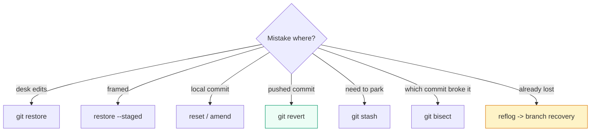

# Undo & Recovery

> Every mistake has a matching undo. Pick by *where* the mistake lives: edited files → `restore`, framed files → unstage, private save → `reset`, shared save → `revert`, lost save → `reflog`, unknown culprit → `bisect` (binary search through history).

## 1. Intuition

Undo tools are sorted by blast radius (how much they can break). `restore` touches files only (history safe). `reset` moves your bookmark (rewrites history — private work only). `revert` adds an anti-save (safe everywhere, even after sharing). `stash` (a clipboard for half-done work you must park *now*) shelves edits. `bisect` finds which save broke things by testing halves. `reflog` is the net under all of it.

```bash
git status --short     # FIRST: where is the damage? desk, frame, save, or pushed?
git restore file.py    # desk-only damage
git revert HEAD        # pushed damage (safe)
```

> You can now: match any mistake to its undo in 10 seconds.

## 2. How it works

- **Uncommitted edits.** Throw away file edits (`restore`), or unframe while keeping edits (`--staged`).
  ```bash
  git restore app.py               # desk back to last save (edits gone — careful)
  git restore -p                   # pick pieces interactively (safe way)
  git restore --staged app.py      # unframe, keep your edits
  ```

- **Last save, private.** Pick what to keep: everything, edits, or nothing. Wrong message only → `--amend`.
  ```bash
  git reset --soft HEAD~1    # undo save, keep framed + edited files
  git reset --mixed HEAD~1   # undo save, keep edited files, unframe all
  git commit --amend -m "better message"   # message was the only problem
  ```

- **Last save, already shared.** Never `reset` — add the antidote and push it.
  ```bash
  git revert HEAD
  git push
  ```

- **Bad merge/rebase.** Mid-flight → abort. Just finished locally → jump back. Already pushed → antidote, not rewrite.
  ```bash
  git merge --abort              # mid-merge exit
  git rebase --abort             # mid-rebase exit
  git reset --hard ORIG_HEAD     # just-finished locally (ORIG_HEAD = position before it)
  ```

- **Park work to switch tasks.** `stash` shelves desk+frame with a label. Apply keeps a copy, pop applies + deletes.
  ```bash
  git stash push -m "wip: login half-done"
  git switch main                # go handle the urgent thing
  git stash pop                  # bring your work back
  git stash list                 # all parked items
  ```

- **Find which save broke it.** `bisect` (automatic binary search) needs a repeatable test — flaky tests blame innocent saves.
  ```bash
  git bisect start
  git bisect bad HEAD            # this version is broken
  git bisect good v1.0.0         # this old version worked
  # Git checks out middles; you answer good/bad each time (or: git bisect run npm test)
  git bisect reset               # exit when it names the guilty save
  ```

- **Resurrect deleted work.** Find the ID in the diary, grow a branch from it.
  ```bash
  git reflog -15
  git branch recovery abc1234
  ```

> You can now: undo at any layer without panic — and park work safely mid-task.

## 3. Visual



Golden rule: pushed → only `revert` (add truth). Private → `reset`/`amend`/`rebase` allowed.

## 4. Use cases

| Use case | When to use (concrete example) | When NOT to / edge case |
|---|---|---|
| Oops in one file | `restore app.py` / `restore -p` for pieces | Other files hold good work — name the file, don't blanket-restore |
| Interrupt work | `stash push -m` → switch → `stash pop` | Work parked for days — `stash branch <name>` instead of aging stashes |
| Kill last private save | `reset --soft/mixed/hard` by what to keep | Already pushed — `revert` |
| Kill pushed bug | `revert <id>`, push the antidote | History must look perfectly linear — needs a coordinated rewrite |
| Bad merge/rebase | `--abort` mid-flight; `ORIG_HEAD` right after | After push — forward-fix/revert, not reset |
| Find regression | `bisect run npm test` with a reliable test | Flaky/manual-only repro — stabilize the signal first |
| Edge case: `restore`/`reset --hard` wiped edits | Happens with unsaved work — no diary exists for unsaved edits, they're gone | Prevention only: commit or `stash` before any destructive undo |

## 5. AI-era leverage

- **Cage the agent:** park your edits before it touches the tree, restore after.
  ```bash
  git stash push -m "mine, before agent"
  # ... agent works ...
  git stash pop
  ```
  ```text
  Ask AI: "Work only in new untracked files. Do not modify tracked files — confirm with git status before finishing."
  ```
- **Hunt agent-caused regressions** without reading 50 saves: `bisect run` + the failing test names the guilty save.

## 6. Limits & tradeoffs

- `restore` / `reset --hard` destroy unsaved work permanently. Instead: commit or stash first — there is no undo for the undo.
  ```bash
  git stash push -m "safety"   # 5 seconds that saves hours
  ```
- `reflog` expires (~90 days) and is local only — server-side rewrites need hosting-side recovery, not reflog.
- `bisect` is only as good as your good/bad markers + a deterministic test. Wrong markers send the search the wrong way.
- Next: permanent markers in [[06-Tags-Worktrees-Internals|06 Tags & Internals]]; combining context in [[04-Merge-Rebase|04 Merge & Rebase]]. Sources in [[../context/Git.resources]]; proof in [[../context/Git.build]].

## 7. Related

- [[../Git|Git hub]] · [[02-Commits-History|02 Commits]] · [[04-Merge-Rebase|04 Merge]] · [[06-Tags-Worktrees-Internals|06 Internals]] · [[../../_MOC|DevOps MOC]] · [[../context/Git.resources]] · [[../context/Git.build]]
