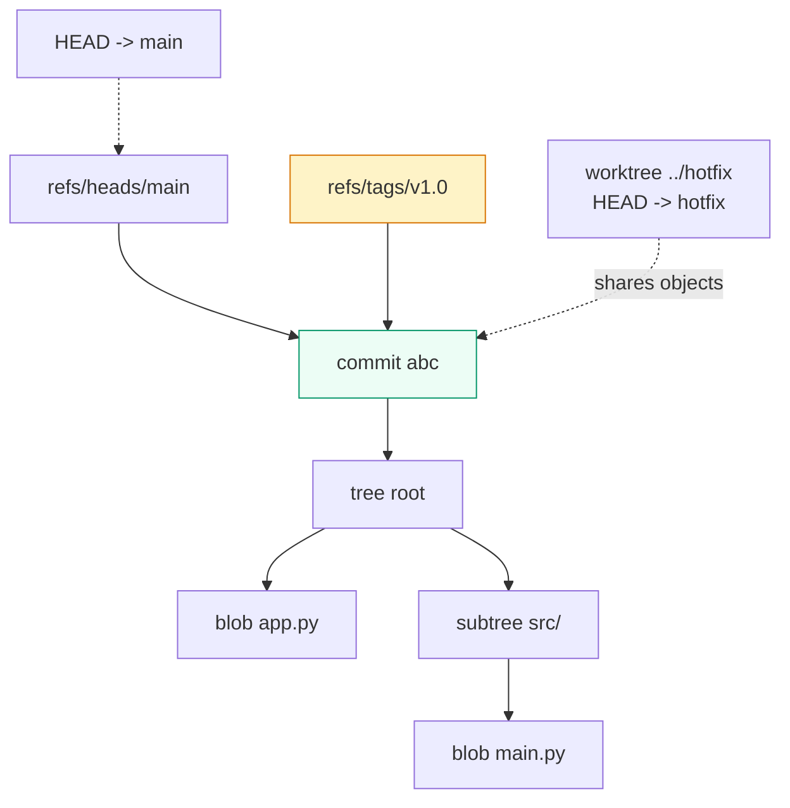

# Tags, Worktrees & Internals

> **Tags** freeze milestones (`v1.0.0`). **Worktrees** open two branches at once with zero stashing. **Internals** explain *why* everything works: files hashed into objects, human names (refs) sliding over them. Learn this and you can release versions and run parallel tasks like a team of two.

## 1. Intuition

If saves are album pages, a **tag** (`v1.0.0` — a fixed name for one save that never slides) is a gold sticker. A **worktree** (a second folder for the same project, each on its own branch) is a second desk for the same album. Underneath: every file version is hashed into a **blob** (file bytes by fingerprint), folders into **trees** (directory listings), snapshots into **commits**, stickers into **tag objects**; **refs** (sticky-note names like `refs/heads/main`) point at them; **HEAD** is your arrow. **Hooks** (scripts that fire on commit/push) are doorbells. **Submodules** (a repo nested inside a repo) are albums glued inside albums.

```bash
git tag -a v1.0.0 -m "first release"   # gold sticker on this save
git worktree add ../hotfix main        # second desk, on main, in ../hotfix
git worktree list                      # you should see both desks
```

> You can now: freeze a release name and open two branches at once.

## 2. How it works

- **Tags.** Plain tags are bare pointers; annotated tags are real objects (message + date + can be signed). Rule: tag releases, never move a published tag.
  ```bash
  git tag -a v2.0.0 -m "release"   # annotated (use this for releases)
  git show v2.0.0 --stat           # what did this release contain?
  git push origin v2.0.0           # tags don't travel with normal push — send explicitly
  git checkout v2.0.0              # read-only look at the release (detached — don't edit here)
  ```

- **Worktrees.** One branch per desk. Best way to run two tasks (or two agents) in parallel.
  ```bash
  git worktree add ../feature-a feature-a
  git worktree list
  git worktree remove ../feature-a     # close the desk when done
  ```

- **Objects (what's really stored).** Blobs (files), trees (folders), commits (snapshots), tags (stickers). Peek with plumbing commands; daily work stays with the friendly ones.
  ```bash
  git cat-file -p HEAD      # pretty-print the newest save object
  git ls-tree HEAD           # what folders/files does it list?
  git count-objects -v       # how big is your local store?
  ```

- **Refs (the sticky notes).** Branches, remote photos, stickers — all just names pointing at IDs.
  ```bash
  git show-ref | head -5          # every name → ID mapping
  git rev-parse main              # what save does "main" mean right now?
  ```

- **Hooks (automatic doorbells).** Scripts in `.git/hooks/` that run on commit/push. A failing check (non-zero exit) blocks the action. Note: they don't travel when someone clones — share them via docs/templates.
  ```bash
  ls .git/hooks/                  # sample scripts live here
  # make .git/hooks/pre-commit executable that runs your linter — bad code can't even save
  ```

- **Submodule vs subtree (repo inside a repo).** Submodule = nested repo pinned at one save (parent doesn't auto-follow its updates). Subtree = merged copy with one shared history (heavier). Small stable snippet → plain copy beats both.
  ```bash
  git submodule add https://github.com/org/lib.git vendor/lib
  git submodule update --init      # teammate just cloned? run this to fill vendor/
  ```

- **Signing + logins.** SSH vs HTTPS links, tokens, and signing (proving *you* wrote it — not that it's correct).
  ```bash
  git log --show-signature -3      # which saves carry a valid signature?
  ```

- **Big files (LFS).** Normal Git keeps every version forever — photos/videos/models bloat it. LFS (Large File Storage — pointers in Git, real bytes on a side server) fixes that.
  ```bash
  git lfs install
  git lfs track "*.psd"
  git add .gitattributes           # the tracking rule itself must be saved
  ```

> You can now: release a version, parallelize two branches, and explain what Git stores.

## 3. Visual



One model: everything is fingerprint-addressed content; refs are human names sliding over it.

## 4. Use cases

| Use case | When to use (concrete example) | When NOT to / edge case |
|---|---|---|
| Release | Annotated + signed tag `v2.0.0`, push it explicitly | Floating `latest` tags as deploy pointers — use releases/branches |
| Parallel work/agents | One `worktree add` per task/branch | Same branch in 2 desks — Git forbids it |
| Gate quality | `pre-commit` lint + `commit-msg` format check | Server enforcement — hooks don't clone; pair with hosting rules |
| Vendor dependency | Submodule (independent upstream) vs subtree (you patch inline) | Small stable snippet — plain copy beats both machines |
| Big binaries | LFS for large blobs; never commit secrets | Committed a secret? Rotating it + rewriting history still leaves copies in others' clones — rotate first, rewrite second |
| Huge/slow clone | Shallow/partial/sparse to start (`clone --depth 1`), full history later | Final release builds — keep full history for audits |
| Edge case: teammate cloned but vendor/ is empty | Happens with submodules — nested repo doesn't auto-fill | Fix: `git submodule update --init` |

## 5. AI-era leverage

- **Agents × worktrees = parallel throughput:** each agent caged in its own desk, no stash dance.
  ```bash
  git worktree add ../agent-a feature-a
  git worktree add ../agent-b feature-b
  ```
  ```text
  Ask AI: "Work only inside ../agent-a on branch feature-a. Never touch the main folder. Finish with git diff --stat."
  ```
- **Agent guardrails:** a `pre-commit` hook runs lint/typecheck even when the agent "forgets."

## 6. Limits & tradeoffs

- Tags don't move — re-tagging a published version breaks everyone who fetched the old sticker. Instead: new version number, new tag.
- Desks share stored objects but not unsaved work — edits can't teleport between desks without stash/commit.
  ```bash
  git stash push -m "move me"   # carry work desk → desk via stash
  ```
- Hooks are local-only; submodules add real mental load (detached nests, two-step saves). Prefer the simplest mechanism your team will actually maintain.
- Next: drive hosting from the shell — [[07-GitHub-CLI|07 GitHub CLI]] then [[08-GitLab-CLI-Automation|08 GitLab CLI]]. Sources in [[../context/Git.resources]]; proof in [[../context/Git.build]].

## 7. Related

- [[../Git|Git hub]] · [[05-Undo-Recovery|05 Undo]] · [[07-GitHub-CLI|07 gh]] · [[DevOps|DevOps MOC]] · [[../context/Git.resources]] · [[../context/Git.build]]
