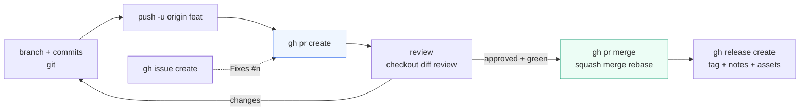

# GitHub CLI (`gh`)

> `gh` drives GitHub without the browser: log in once, then open/review/merge requests, triage tasks, ship releases, and script anything — all from your terminal.

## 1. Intuition

`git` moves code; `gh` moves *conversations about code*. Login (`auth login`) is your badge. `repo` manages the rooms. `pr` (pull request — a proposal to merge one branch into another, with review) runs the review conveyor: branch → push → `pr create` → review → changes → `merge`. `issue` (a tracked task/bug) runs the todo conveyor. `release` wraps a tag with notes + files. `api` (any GitHub web endpoint from the terminal, JSON out) is the escape hatch, shaped with `jq` (a JSON filter tool).

```bash
gh auth login
gh pr status        # your requests: waiting on you vs waiting on others
gh issue list --limit 5
```

> You can now: log in and see your reviews + tasks without opening a browser.

## 2. How it works

- **Login once.** Badge stored, used for both site actions and `git push`.
  ```bash
  gh auth login
  gh auth status              # who/where — run this first when a command says 403
  gh auth setup-git           # makes git push use gh's login
  ```

- **Projects.** Publish local work, grab others', target any repo from anywhere with `-R`.
  ```bash
  gh repo create my-app --private --source=. --push   # publish this folder
  gh repo clone owner/repo
  gh repo view --web -R owner/repo
  ```

- **Requests (the core loop).** Full review cycle without leaving the shell.
  ```bash
  git switch -c feat && git commit -am "add x" && git push -u origin feat
  gh pr create --title "Add x" --body "Why + what + tests"
  gh pr checks                # is CI (automatic tests) green?
  gh pr checkout 12           # review request #12 locally
  gh pr diff                  # read the change
  gh pr review --approve --body "lgtm"
  gh pr merge --squash --delete-branch
  ```

- **Tasks.** Labels/assignees/milestones are the triage fields; writing `Fixes #n` in a request auto-closes task `n` on merge.
  ```bash
  gh issue create --title "Login breaks on empty email" --label bug
  gh issue list --label bug
  gh issue view 34
  gh issue close 34 --reason completed
  ```

- **Ship versions.** Tag (see 06) + notes + files = a downloadable release.
  ```bash
  gh release create v1.0.0 --title "v1.0.0" --generate-notes
  gh release list
  ```

- **Automate with JSON, never scrape tables.** `--json` + `--jq` keep scripts stable.
  ```bash
  gh pr list --json number,title,author --jq '.[] | select(.author.login=="me")'
  gh api repos/owner/repo --paginate --jq '.name'
  ```

> You can now: run the whole request loop — create → check → review → merge — from the terminal.

## 3. Visual



Terminal loop to memorize: `pr create` → `pr view` → `pr checkout` → `pr diff` → `pr review` → `pr merge`.

## 4. Use cases

| Use case | When to use (concrete example) | When NOT to / edge case |
|---|---|---|
| Publish a project | `repo create --source=. --push` after first local save | Remote exists — `clone`, don't re-create |
| Daily reviews | `pr status`, `checkout`, `diff`, `review` from shell | Giant visual diffs — add `--web` and use the browser |
| Triage | `issue list --label bug`, `view`, `comment`, `close` | Long discussions — issues track work, discussions discuss |
| Ship version | Tag (see 06) → `release create --generate-notes` + files | Moving targets — releases are milestones, don't reuse numbers |
| Automate | `api ... --paginate` + `jq` + shell | One-off click — browser is faster for single actions |
| Edge case: commands fail with 403 | Happens when your login lacks permission for that action | Fix: `gh auth status` → `gh auth refresh` (add the missing scope) → retry |

## 5. AI-era leverage

- **Agents open, humans review from the terminal** — local testing beats reading pasted code in chat.
  ```bash
  gh pr checkout 12 && npm test
  gh pr diff --name-only
  ```
  ```text
  Ask AI: "PR #12 is checked out locally. Summarize its diff in 5 bullets and list what tests I should run."
  ```
- **Nightly triage without meetings:** list → filter stale with `jq` → nudge.
  ```bash
  gh issue list --json number,title,updatedAt --jq '.[] | select(.title | contains("stale"))'
  ```

## 6. Limits & tradeoffs

- `gh` inherits your login's permissions — weak tokens fail with 403. Instead: `auth status`/`refresh` first.
  ```bash
  gh auth status && gh auth refresh
  ```
- Terminal reviews lack rich UI (suggestion buttons, huge build tables) — use `--web` for those, CLI for the loop.
- Scripts built on human-readable tables break on the next update — always `--json` + `--jq` for machines.
- Next: GitLab's twin in [[08-GitLab-CLI-Automation|08 GitLab CLI & Automation]]; history underneath in [[02-Commits-History|02 Commits]]. Sources in [[../context/Git.resources]]; proof in [[../context/Git.build]].

## 7. Related

- [[../Git|Git hub]] · [[06-Tags-Worktrees-Internals|06 Tags]] · [[08-GitLab-CLI-Automation|08 glab]] · [[DevOps|DevOps MOC]] · [[../context/Git.resources]] · [[../context/Git.build]]
