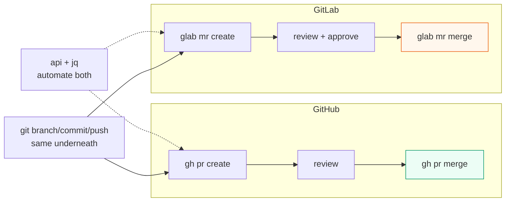

# GitLab CLI & Automation (`glab`)

> `glab` is GitHub CLI's twin for GitLab: same terminal shape, GitLab nouns (projects = repos, Merge Requests = Pull Requests). Learn the small map once, then automate both with `api + jq` (web endpoints + JSON filter).

## 1. Intuition

If `gh` drives GitHub, `glab` drives GitLab — and GitLab calls repositories **projects**. Pull Request → **Merge Request (MR)** (same idea: propose branch A into branch B with review). `gh pr` → `glab mr`. `gh issue` → `glab issue`. The rest rhymes: log in, fork/clone, branch, push, open request, review, approve, merge. Automation is identical plumbing: CLI prints JSON, `jq` shapes it, shell acts on it.

```bash
glab auth login
glab mr status 2>/dev/null || glab mr list --output json | head -c 300
glab issue list --per-page 5
```

> You can now: say the GitHub→GitLab word map and list your requests + tasks.

## 2. How it works

- **Login.** Works against gitlab.com or your company's own GitLab address (auto-detected from your remotes). Full power needs a token with `api` scope.

  ```bash
  glab auth login
  glab auth status
  ```

- **Projects (= repos).** Same verbs as GitHub, plus GitLab ideas: namespaces/groups (folders for projects), visibility per project.

  ```bash
  glab repo clone group/project
  glab repo view --web
  ```

- **Requests (the core loop).** Review cycle mirrors 07: check out → read → comment/approve → merge. Approvals are first-class (projects can require N approvals).

  ```bash
  git switch -c feat && git commit -am "add x" && git push -u origin feat
  glab mr create --fill --target-branch main --remove-source-branch
  glab mr list
  glab mr checkout 5
  glab mr diff 5
  glab mr approve 5
  glab mr merge 5 --squash --remove-source-branch
  ```

- **Tasks.** Notes = comments; threads resolve like GitHub review threads.

  ```bash
  glab issue create --title "Crash on empty email" --label bug
  glab issue list --label bug
  glab issue view 7
  ```

- **Automate both CLIs the same way.** List as JSON → filter with `jq` → act. Never scrape human tables.

  ```bash
  glab mr list --output json | jq '.[] | {iid, title, author}'
  glab api projects --paginate | jq '.[].name'
  ```

- **The map (learn once).** `gh auth`→`glab auth`, `gh repo`→`glab repo`, `gh pr`→`glab mr`, `gh issue`→`glab issue`, `gh release`→`glab release`, `gh api`→`glab api`. Underneath, **Git owns history; hosting owns collaboration; CLIs drive hosting from the terminal.**

> You can now: run the GitLab request loop and translate any `gh` command to `glab`.

## 3. Visual



One map to memorize: PR=MR, `gh`=GitHub, `glab`=GitLab, `api+jq`=both.

## 4. Use cases

| Use case | When to use (concrete example) | When NOT to / edge case |
|---|---|---|
| Contribute to a GitLab project | Fork → clone → branch → `mr create --fill` → approve → merge | Pushing to canonical directly — requests are the review gate |
| Review fast | `mr list`, `checkout`, `diff`, `note`, `approve` | Giant requests — ask for splits; terminal can't fix size |
| Triage at scale | `issue list` + `jq` filters + `note` nudges | One-off human conversations — UI threads read better |
| Cross-platform teams | Learn `gh`, map to `glab` (near-zero relearning) | Assuming flags match exactly — check `--help` per CLI |
| Script everything | `api --paginate` + `jq` + shell | Secrets inside scripts — use env vars + minimal token scopes |
| Edge case: new flags fail on company GitLab | Happens when the server runs an older version than your CLI | Fix: check server version, pin CLI version per instance, use `api` directly for missing flags |

## 5. AI-era leverage

- **One reviewer script for both platforms** — swap `pr`↔`mr`, keep the `jq` filters.

  ```bash
  gh pr list --json number,title --jq '.[].title'
  glab mr list --output json | jq '.[].title'
  ```

  ```text
  Ask AI: "Here are open request titles from both platforms (pasted). Group them by risk: safe to merge, needs tests, needs human review."
  ```

- **Agent opens with `--fill`** (description linked to the task); humans approve from the terminal after `diff`.

## 6. Limits & tradeoffs

- `glab` follows GitLab's web surface — older company servers can break new flags. Instead: pin CLI per instance, fall back to `api`.

- Request approvals/rules live server-side; the CLI can't bypass them (by design). Automation proposes, policy disposes.

- Fewer extensions than `gh` — default to `api` scripts over plugins.

- Track complete: hub [[../Git|Git hub]] · model [[01-Fundamentals|01]] · history [[02-Commits-History|02]] · branches [[03-Branches-Remotes|03]] · combining [[04-Merge-Rebase|04]]. Sources in [[../context/Git.resources]]; proof in [[../context/Git.build]].

## 7. Related

- [[../Git|Git hub]] · [[../context/Git.resources]] · [[../context/Git.build]]
